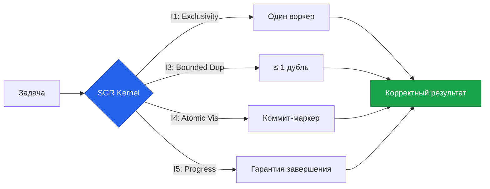

# 🚀 SGR Kernel (Agentic OS)

> **Enterprise-Grade Agentic Kernel for Automated Research & Engineering / Ядро корпоративного уровня для автоматизированных исследований и инжиниринга**


---

## 🇷🇺 Русский (Russian)

### ℹ️ Обзор
SGR Kernel — это операционная система для AI Агентов, построенная на концепции **Multi-Agent Swarm**. Ядро обеспечивает детерминированное выполнение, безопасность и соблюдение регуляторных требований (152-ФЗ, GDPR).

### 🏗️ Архитектура
1.  **Swarm Orchestration**: Легковесный цикл, передающий контекст между агентами: `RouterAgent`, `KnowledgeAgent`, `DataAgent`, `PeftAgent`, `WriterAgent`.
2.  **Декаплинг**: Тяжелые зависимости (VectorDB, PyTorch) подгружаются только внутри скиллов (Lazy Load).
3.  **Безопасность**: Изоляция исполнения, ACL-контроль скиллов и санирование вывода в реальном времени.

### ⚡ Быстрый старт
```bash
# 1. Установка
pip install -r requirements.txt

# 2. Запуск тестов
pytest tests/

# 3. Запуск ядра (CLI)
python main.py

# 4. Запуск WebUI
chainlit run ui_app.py
```

### 🧩 Экосистема Скиллов
*   **Knowledge Base (RAG)**: Поиск по внутренним документам.
*   **PEFTlab**: Настройка и дообучение моделей (Mamba, RWKV).
*   **Logic-RL**: Продвинутые рассуждения и логика.
*   **Data Analyst**: Визуализация и анализ данных.

### 💡 Why SGR?

Потому что «работает на моей машине» — это не гарантия.

Современные системы оркестрации (Kubernetes, Temporal, Kafka) решают задачи **планирования** и **транспорта**. Но ни одна из них не отвечает на главный вопрос:

> «Выполнилась ли моя задача **корректно**, **ровно один раз**, при сбоях, ретраях и сетевой асинхронности?»

SGR Kernel — это **слой корректности** (Correctness Layer), который добавляет формальные гарантии выполнения:

| Гарантия | Что это значит |
|----------|---------------|
| ✅ Execution Exclusivity | Задачу выполняет только один воркер |
| ✅ Bounded Duplication | Дублирование ≤ 1 попытки на цикл аренды |
| ✅ Atomic Visibility | Результаты видны только после полного коммита |
| ✅ Eventual Progress | Задача завершится, даже если воркер упал |

Это не «ещё один оркестратор». Это **формальная граница доверия** между намерением и выполнением.



👉 **[Узнать больше: Почему SGR? (Философия и детали)](docs/why_sgr.md)**

---

## 🇺🇸 English

### ℹ️ Overview
SGR Kernel is an Agentic Operating System built on the **Multi-Agent Swarm** concept. The kernel provides deterministic execution, security, and regulatory compliance (GDPR, HIPAA, 152-FZ).

### 🏗️ Architecture
1.  **Swarm Orchestration**: A lightweight loop that routes tasks between specialized agents: `RouterAgent`, `KnowledgeAgent`, `DataAgent`, `PeftAgent`, `WriterAgent`.
2.  **Decoupling**: Heavy dependencies (VectorDBs, PyTorch) are strictly lazy-loaded within their respective Skills.
3.  **Safety & Security**: Execution isolation, Skill ACL enforcement, and output sanitization at every turn.

### ⚡ Quick Start
```bash
# 1. Install
pip install -r requirements.txt

# 2. Run Tests
pytest tests/

# 3. Start Kernel (CLI)
python main.py

# 4. Start WebUI
chainlit run ui_app.py
```

### 🧩 Skills Ecosystem
*   **Knowledge Base (RAG)**: Decoupled vector search for internal manuals.
*   **PEFTlab**: Integrated HPO and model fine-tuning (Mamba, RWKV).
*   **Logic-RL**: Advanced reasoning and rule-based reinforcement learning.
*   **Data Analyst**: Automatic dataset charting and statistical summaries.

---

## 📚 Documentation Index / Индекс Документации

| Document | Purpose / Назначение |
| :--- | :--- |
| **[KERNEL_SPEC.md](KERNEL_SPEC.md)** | Technical Protocol / Технический протокол |
| **[RELEASE.md](RELEASE.md)** | Release Notes & Migration / Заметки к релизу |
| **[SKILL_DEVELOPMENT.md](SKILL_DEVELOPMENT.md)** | Manual for Developers / Руководство разработчика |
| **[Architecture](docs/architecture.md)** | Diagrams & Flow / Схемы и потоки данных |
| **[CHANGELOG.md](CHANGELOG.md)** | Version History / История версий |

---

## 🛡️ Compliance / Комплаенс
*   **152-FZ (RU)**: Data localization and logging.
*   **GDPR (EU)**: Right to be forgotten and PII masking.
*   **HIPAA (US)**: Secure audit trails for medical data.
