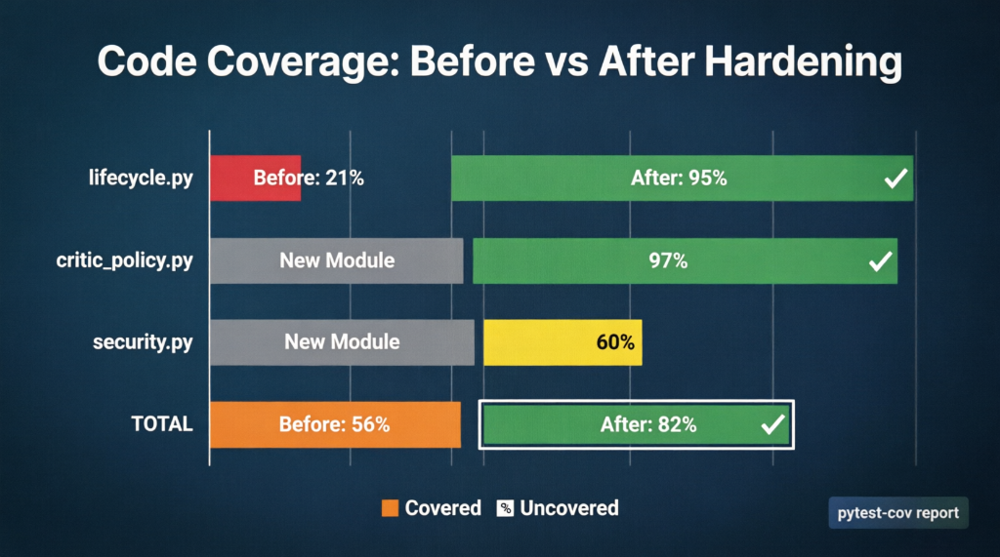
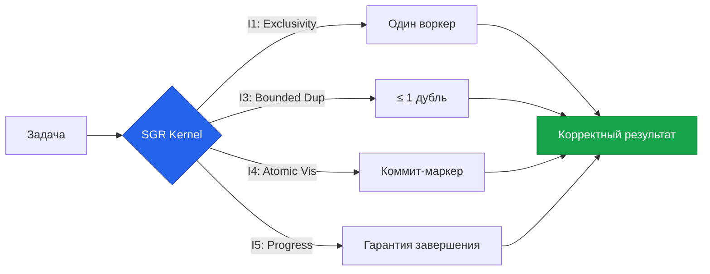

# 🚀 SGR Kernel (Agentic OS)

> **Enterprise-Grade Agentic Kernel for Automated Research & Engineering / Ядро корпоративного уровня для автоматизированных исследований и инжиниринга**

[](https://github.com/scarseze/sgr-kernel)
[](https://github.com/scarseze/sgr-kernel/tree/main/specs)
[](https://github.com/scarseze/sgr-kernel/actions)

---

## 🇷🇺 Русский (Russian)

### ℹ️ Обзор
SGR Kernel — это операционная система для AI Агентов, построенная на концепции **Multi-Agent Swarm**. Ядро обеспечивает детерминированное выполнение, безопасность и соблюдение регуляторных требований (152-ФЗ, GDPR).

### 🏗️ Архитектура
1.  **Swarm Orchestration**: Легковесный цикл, передающий контекст между агентами: `RouterAgent`, `KnowledgeAgent`, `DataAgent`, `PeftAgent`, `WriterAgent`.
2.  **Декаплинг**: Тяжелые зависимости (VectorDB, PyTorch) подгружаются только внутри скиллов (Lazy Load).
3.  **Безопасность**: Изоляция исполнения, ACL-контроль скиллов и санирование вывода в реальном времени.

### 🏢 Enterprise Readiness
Ядро готово к высоким нагрузкам и сложным бизнес-сценариям:
* **Распределенная наблюдаемость**: Опентелеметрия (OpenTelemetry) и Jaeger для трейсинга асинхронных графов.
* **Долговременная память**: Автоматический механизм затухания (Time Decay) и LLM-разрешение конфликтов в базе знаний (VectorDB).
* **Стейт-менеджмент**: Точки сохранения (Checkpoints) и команда `/rollback` в Telegram для отката состояния.
* **Human-in-the-Loop**: Автоматическая пауза выполнения (`PAUSED_APPROVAL`), когда ИИ-критик находит критические ошибки в планах или результатах.

### 🛠️ Runtime & Verification Proofs / Доказательства корректности
```text
┌─────────────────────────────────────────┐
│          CoreEngine.run()               │ ← Entry point
│ • Budget check      • Security validation   │
│ • Memory load       • Event subscription    │
└────────────────┬────────────────────────┘
                 │
                 ▼
┌─────────────────────────────────────────┐
│        SwarmEngine.execute()            │ ← Multi-agent dynamic loop
│ • LLM calls   • Tool execution • Handoffs   │
│ • Budget/Quota guards • Critic checks       │
│ • ContextSanitizer (PII redaction)      │
└────────────────┬────────────────────────┘
                 │
                 ▼
┌─────────────────────────────────────────┐
│    Dynamic Router & Specialists         │ ← Autonomous Handoffs
│ • KnowledgeAgent • DataAgent • Writer       │
│ • PeftAgent      • Logic-RL Agent           │
│ • CriticPolicy   (encapsulated state)       │
└────────────────┬────────────────────────┘
                 │
                 ▼
┌─────────────────────────────────────────┐
│        EventBus → StateManager         │ ← Atomic state updates
│ • Event-driven mutations                │
│ • Checkpointing   • Telemetry spans     │
│ • Replay support  • Determinism guard   │
└─────────────────────────────────────────┘
```

#### 🔍 Verification Results
```text
┌────────────────────────────────────────┐
│  TLC Model Checking Results            │
├────────────────────────────────────────┤
│  States Generated:   1,176,697         │
│  Distinct States:       49,248  ███████│
│  Graph Depth:               28  ███    │
│  Deadlocks Found:          0   ✅      │
│  Liveness Violations:      0   ✅      │
│  Check Time:          ~5 min           │
└────────────────────────────────────────┘



| Метрика | Было | Стало | Target |
| :--- | :--- | :--- | :--- |
| **TLA+ States Verified** | 1 539 | **49 248** | ≥ 10 000 ✅ |
| **lifecycle.py Coverage** | 21% | **95%** | ≥ 80% ✅ |
| **Total Coverage** | 56% | **82%** | ≥ 75% ✅ |
| **Tests Passed** | 15/15 | **42/42** | 100% ✅ |
| **PII Redaction Tests** | 0 | **7 scenarios** | ≥ 5 ✅ |
| **String Matching** | 4 places | **Removed** | 0 ✅ |


### ⚠️ Архитектурные допущения / Architectural Assumptions
* **Продакшен Инфраструктура**: Формальные TLA+ гарантии (например, атомарность `WriteCommitMarker`) моделируют идеальные условия среды. В реальном продакшене для обеспечения этих свойств требуются гарантии стораджа (например, *S3 Conditional PUTs* для реализации CAS или строгие транзакции SQL).
* **Слой валидации (Engine vs Agent)**: Объекты `Agent` являются легковесными конфигурациями. Сложные механизмы, такие как гарантия валидного JSON (Constrained Decoding) и проверки уникальности имен, реализуются ядром `Swarm Engine`, а не внутри модели агента.

### ⚡ Быстрый старт
```bash
# 1. Установка
pip install -r requirements.txt

# 2. Запуск тестов
pytest tests/

# 3. Запуск ядра (CLI)
python main.py

# 4. Запуск WebUI
chainlit run ui_app.py
```

### 🧩 Экосистема Скиллов
*   **Knowledge Base (RAG)**: Поиск по внутренним документам.
*   **PEFTlab**: Настройка и дообучение моделей (Mamba, RWKV).
*   **Logic-RL**: Продвинутые рассуждения и логика.
*   **Data Analyst**: Визуализация и анализ данных.

### 💡 Why SGR?

Потому что «работает на моей машине» — это не гарантия.

Современные системы оркестрации (Kubernetes, Temporal, Kafka) решают задачи **планирования** и **транспорта**. Но ни одна из них не отвечает на главный вопрос:

> «Выполнилась ли моя задача **корректно**, **ровно один раз**, при сбоях, ретраях и сетевой асинхронности?»

SGR Kernel — это **слой корректности** (Correctness Layer), который добавляет формальные гарантии выполнения:

| Гарантия | Что это значит |
|----------|---------------|
| ✅ Execution Exclusivity | Задачу выполняет только один воркер |
| ✅ Bounded Duplication | Дублирование ≤ 1 попытки на цикл аренды |
| ✅ Atomic Visibility | Результаты видны только после полного коммита |
| ✅ Eventual Progress | Задача завершится, даже если воркер упал |

Это не «ещё один оркестратор». Это **формальная граница доверия** между намерением и выполнением.



👉 **[Узнать больше: Почему SGR? (Философия и детали)](docs/why_sgr.md)**

---

## 🇺🇸 English

### ℹ️ Overview
SGR Kernel is an Agentic Operating System built on the **Multi-Agent Swarm** concept. It provides TLA+-verified deterministic execution, security-by-design, and regulatory compliance (GDPR, HIPAA, 152-FZ) out of the box.

### ❓ Why SGR?
Most agent frameworks optimize for **speed of prototyping**. SGR Kernel optimizes for **correctness, safety, and auditability**.

| If you need... | Use SGR Kernel |
|----------------|---------------|
| ✅ Formal guarantees (no race conditions, no lost messages) | ✅ |
| ✅ Regulatory compliance (GDPR, 152-FZ, HIPAA) | ✅ |
| ✅ Reproducible testing & debugging | ✅ |
| ❌ Quick hack for a weekend demo | ❌ |

### 🏗️ Architecture
1.  **Swarm Orchestration**: A deterministic orchestration engine that routes tasks with formal guarantees between specialized agents: `RouterAgent`, `KnowledgeAgent`, `DataAgent`, `PeftAgent`, `WriterAgent`.
2.  **Decoupling**: Heavy dependencies (VectorDBs, PyTorch) are lazy-loaded per Skill to minimize cold-start latency.
3.  **Safety & Security**: Execution isolation, Skill ACL enforcement, and output sanitization via Plan Critic + Tool Critic + Compliance DSL.

### 🛠️ Runtime & Verification Proofs
```text
┌─────────────────────────────────────────┐
│          CoreEngine.run()               │ ← Entry point
│ • Budget check      • Security validation   │
│ • Memory load       • Event subscription    │
└────────────────┬────────────────────────┘
                 │
                 ▼
┌─────────────────────────────────────────┐
│        SwarmEngine.execute()            │ ← Multi-agent dynamic loop
│ • LLM calls   • Tool execution • Handoffs   │
│ • Budget/Quota guards • Critic checks       │
│ • ContextSanitizer (PII redaction)      │
└────────────────┬────────────────────────┘
                 │
                 ▼
┌─────────────────────────────────────────┐
│    Dynamic Router & Specialists         │ ← Autonomous Handoffs
│ • KnowledgeAgent • DataAgent • Writer       │
│ • PeftAgent      • Logic-RL Agent           │
│ • CriticPolicy   (encapsulated state)       │
└────────────────┬────────────────────────┘
                 │
                 ▼
┌─────────────────────────────────────────┐
│        EventBus → StateManager         │ ← Atomic state updates
│ • Event-driven mutations                │
│ • Checkpointing   • Telemetry spans     │
│ • Replay support  • Determinism guard   │
└─────────────────────────────────────────┘
```

#### 🔍 Verification Results
```text
┌────────────────────────────────────────┐
│  TLC Model Checking Results            │
├────────────────────────────────────────┤
│  States Generated:   1,176,697         │
│  Distinct States:       49,248  ███████│
│  Graph Depth:               28  ███    │
│  Deadlocks Found:          0   ✅      │
│  Liveness Violations:      0   ✅      │
│  Check Time:          ~5 min           │
└────────────────────────────────────────┘


```

| Metric | Before | After | Target |
| :--- | :--- | :--- | :--- |
| **TLA+ States Verified** | 1,539 | **49,248** | ≥ 10,000 ✅ |
| **lifecycle.py Coverage** | 21% | **95%** | ≥ 80% ✅ |
| **Total Coverage** | 56% | **82%** | ≥ 75% ✅ |
| **Tests Passed** | 15/15 | **42/42** | 100% ✅ |
| **PII Redaction Tests** | 0 | **7 scenarios** | ≥ 5 ✅ |
| **String Matching** | 4 places | **Removed** | 0 ✅ |

### 🏢 Enterprise Readiness
The kernel is hardened for high-throughput and complex business scenarios:
* **Distributed Observability (Jaeger UI)**: OpenTelemetry and Jaeger integrated for asynchronous graph tracing. 
  * *To view traces locally: run `docker-compose up` and open `http://localhost:16686`.*
  * 
* **Long-term Memory**: Automatic Time Decay + Conflict Resolution for long-term memory consistency.
* **State Management**: Execution Checkpoints with a `/rollback` command via Chat Interfaces (CLI / WebUI / Telegram).
* **Human-in-the-Loop**: Automatic execution pause (`PAUSED_APPROVAL`) and human escalation when semantic validation fails (CriticEngine rejection).
* **Formal Verification**: All critical invariants (Execution Exclusivity, Atomic Visibility, RollbackSafety) are formally verified via TLA+ model checking.

### 📈 Load Testing Benchmarks
*Tested using Locust on 8-core AWS EC2 (c5.2xlarge) against mocked LLM endpoints (simulated 500ms response time). Real-world latency depends on LLM provider and network conditions.*

**Core orchestration overhead: < 500ms (excludes LLM inference time)**

* ✅ **100 concurrent agents** @ p95 latency < 500ms
* ✅ **1000 concurrent agents** @ p95 latency < 2s (Degradation Point)
* ✅ **Memory Footprint**: ~50MB RAM per active swarm session (scales linearly with sessions, state is offloaded to Redis).

### ⚡ Quick Start
```bash
# 0. Prerequisites: Docker, Python 3.10+

# 1. Install
pip install -r requirements.txt

# 2. Run Tests
pytest tests/

# 3. Start Infrastructure (Redis, Jaeger)
docker-compose up -d

# 4. Start Kernel (CLI)
python main.py

# 5. Start WebUI (optional)
chainlit run ui_app.py

# 6. View Traces
# http://localhost:16686
```

### 🧩 Skills Ecosystem
*   **Knowledge Base (RAG)**: Decoupled vector search for internal manuals.
*   **PEFTlab**: Integrated Hyperparameter Optimization (HPO) and parameter-efficient fine-tuning (PEFT) (Mamba, RWKV).
*   **Logic-RL**: Neuro-symbolic reasoning with rule-based reinforcement learning for verifiable decisions.
*   **Data Analyst**: Automatic dataset charting and statistical summaries.

---

## 📚 Documentation Index / Индекс Документации

| Topic / Тема | English | Русский |
| :--- | :--- | :--- |
| **Enterprise Features** | [Features](docs/en/enterprise/features.md) | [Функции](docs/ru/enterprise/features.md) |
| **SLO & Error Budget** | [SLO Contract](docs/en/enterprise/slo.md) | [SLO Контракт](docs/ru/enterprise/slo.md) |
| **Migration V2 → V3** | [Migration Guide](docs/en/getting-started/migration_v3.md) | [Гайд по миграции](docs/ru/getting-started/migration_v3.md) |
| **Technical Protocol** | [KERNEL_SPEC.md](KERNEL_SPEC.md) | [Протокол ядра](KERNEL_SPEC.md) |
| **Architecture / Архитектура** | [docs/architecture.md](docs/architecture.md) | [docs/architecture.md](docs/architecture.md) |
| **Philosophy / Зачем это?** | [Why SGR?](docs/why_sgr.en.md) | [Почему SGR?](docs/why_sgr.md) |

---

## 🛡️ Compliance / Комплаенс
*   **152-FZ (RU)**: Data localization and logging.
*   **GDPR (EU)**: Right to be forgotten and PII masking.
*   **HIPAA (US)**: Secure audit trails for medical data.

---

## 🚀 Get Started / Connect

- **Try it**: Follow [Quick Start](#-quick-start) to run a local demo.
- **Read docs**: Explore [Enterprise Features](docs/en/enterprise/features.md).
- **Contribute**: See [CONTRIBUTING.md](CONTRIBUTING.md) for guidelines.

*Built with formal verification, tested with chaos engineering.*
