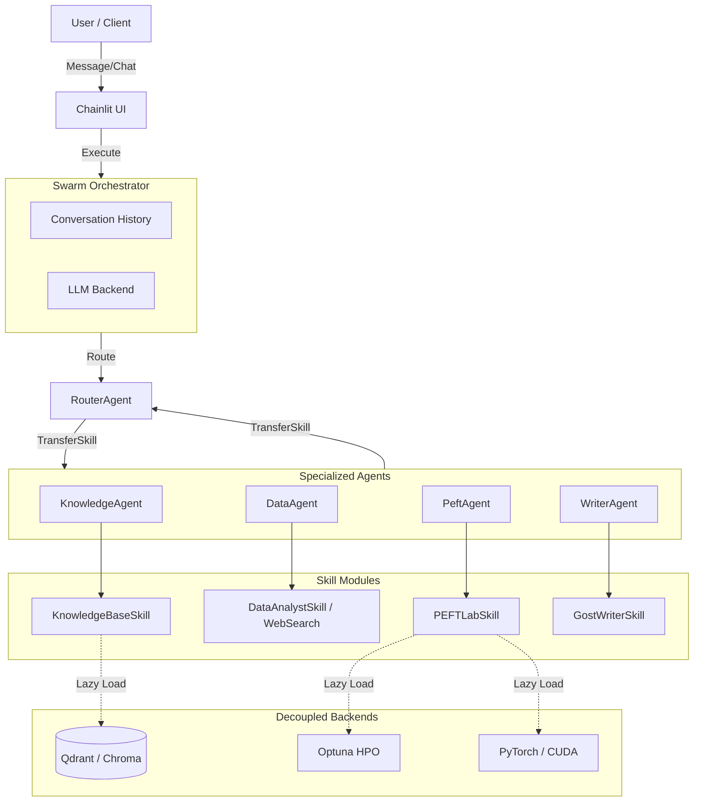

# 🏛️ Architecture

## 🤖 High-Level Agent Architecture



## ⚡ Abstract Execution Flow

```text
User Message -> WebUI
     │
     ▼
SwarmEngine.execute(active_agent, history)
     │
     ▼
active_agent (e.g. RouterAgent) -> LLM generate
     │
     ▼
LLM returns ToolCall(transfer_to_knowledgeagent)
     │
     ▼
Handoff Skill executes, returns TransferToAgent
     │
     ▼
SwarmEngine updates active_agent = KnowledgeAgent
SwarmEngine updates history System Prompt
     │
     ▼
KnowledgeAgent -> LLM generate
     │
     ▼
LLM returns ToolCall(knowledge_base_search)
     │
     ▼
KnowledgeBaseSkill dynamically loads VectorDB dependencies
     │
     ▼
Results appended to history
     │
     ▼
KnowledgeAgent generates text response -> User
```

---

# Архитектура (Architecture)

## 🤖 Высокоуровневая Архитектура Агента (Swarm)

*   **⚙️ Swarm Engine**: Легковесный движок-оркестратор. Управляет историей диалога и бесшовно передает контекст между Агентами.
*   **🚦 RouterAgent**: Маршрутизатор. Анализирует запрос и решает, какому узкоспециализированному Агенту передать задачу.
*   **👥 Specialized Agents**: 
    *   **🧠 KnowledgeAgent**: Владеет RAG (База знаний).
    *   **📊 DataAgent**: Владеет аналитикой и веб-серфингом.
    *   **🔧 PeftAgent**: Владеет машинным обучением (PEFTlab, HPO).
    *   **✍️ WriterAgent**: Владеет форматированием отчетной документации по ГОСТ 19 и 34.
*   **🛠️ Skills (Навыки)**: Инструменты, которые привязаны к конкретному Агенту. Тяжелые зависимости (`chromadb`, `optuna`, `torch`) загружаются **лениво** (Lazy Load), чтобы не замедлять ядро.

---

## 🛡️ L8 Distinguished Guarantees, Invariants, & Constraints (Гарантии L8)
В архитектуре SGR Kernel заложен строгий набор формальных инвариантов, специально разработанных для выживания в условиях хаоса, "шумных соседей" и экстремальной конкуренции за ресурсы:

*   **📈 Eventual Progress Guarantees (Гарантии конечного прогресса):** Система гарантирует продвижение вперед при ограниченной конкуренции $C$, несмотря на уровень прерывания транзакций до 15% в условиях изоляции БД `SERIALIZABLE`. Это обеспечивается жесткими бюджетами на повторные попытки (retries) с полным джиттером (full jitter) и эскалацией приоритетов.
*   **🚦 Admission Control (Контроль доступа / Multi-Dimensional DRF):** Для предотвращения борьбы за общие ресурсы (например, GPU против CPU-нагрузок), Admission Control рассчитывает квоты по многомерному вектору ресурсов (Dominant Resource Fairness), а не полагаясь на наивные, равномерные корзины токенов (token buckets).
*   **⏱️ SLO Isolation & Tail Amplification (Изоляция SLO):** Явное моделирование корреляции хвостов (tail correlation) предотвращает геометрическое усиление задержек выполнения очередей из-за повторных попыток хранилища/БД, гарантируя соблюдение лимитов SLO на каждом этапе.
*   **🔌 Failure Domain Decoupling (Разделение доменов отказа):** Плоскость исполнения (execution plane) остается полностью независимой от доступности БД во время работы. Сбой базы данных вызовет лишь ограниченное дублирование исполнения при восстановлении, но никогда не приведет к падению активных вычислительных узлов.
*   **📦 Atomic S3 Protocol (Атомарный протокол S3):** Поскольку псевдо-операции `RENAME` в S3 изначально уязвимы (COPY+DELETE), атомарная видимость строго опирается на версионируемые пути хранилища и атомарные маркеры фиксации `_SUCCESS`.
*   **🔥 Formal Failure Model (Формальная модель отказов):** Система нацелена исключительно на устойчивость к остановкам при сбое (crash-stop). Она не терпит Византийских ошибок (Byzantine errors) и предполагает конечное восстановление сети и оборудования.

Для исчерпывающего архитектурного обоснования обратитесь к:
*   [📑 L8 Distinguished System Invariants](l8_distinguished_invariants.md)
*   [⚖️ L8 Architecture Annex & Tradeoffs](L8_ARCHITECTURE_ANNEX.md)
