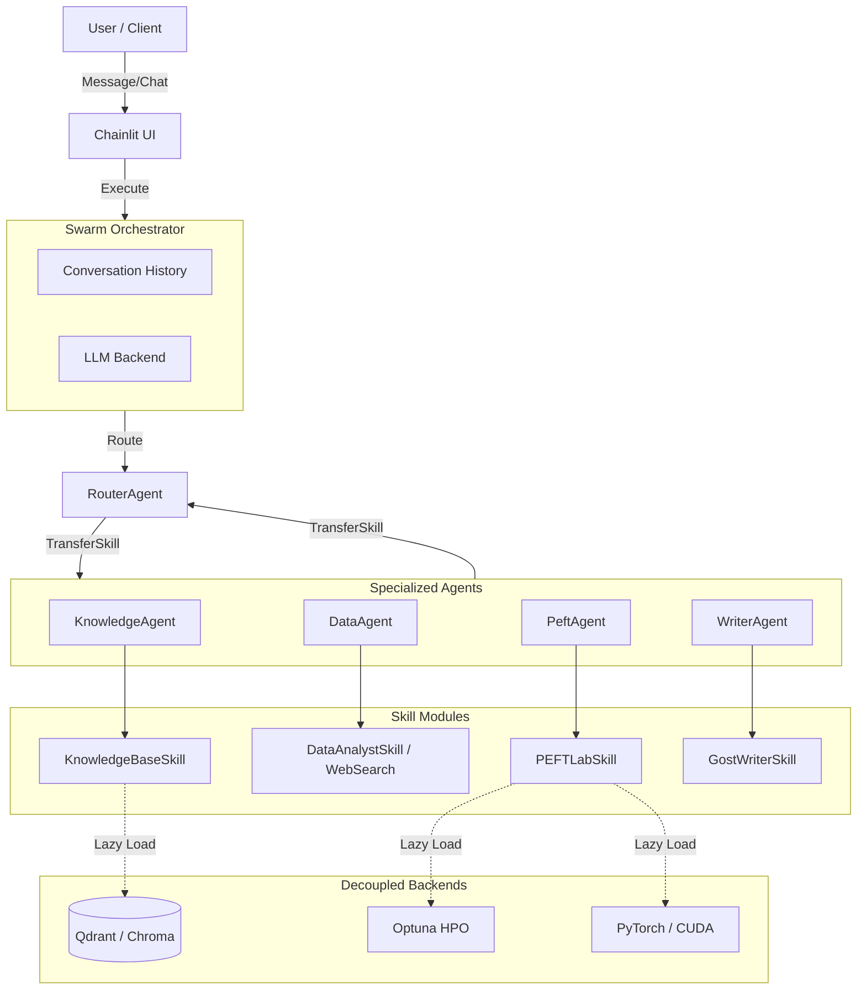
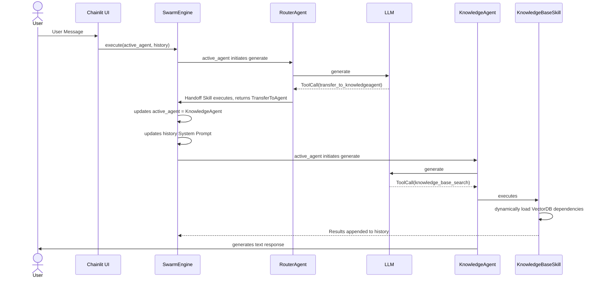

# Architecture

## 🤖 High-Level Agent Architecture

*   **⚙️ Swarm Engine**: Lightweight orchestrator engine. Manages dialogue history and seamlessly passes context between Agents.
*   **🚦 RouterAgent**: The router. Analyzes the request and decides which highly specialized Agent to transfer the task to.
*   **👥 Specialized Agents**: 
    *   **🧠 KnowledgeAgent**: Owns RAG (Knowledge Base).
    *   **📊 DataAgent**: Owns analytics and web-surfing.
    *   **🔧 PeftAgent**: Owns machine learning (PEFTlab, HPO).
    *   **✍️ WriterAgent**: Owns formatting of reporting documents according to GOST 19 and 34.
*   **🛠️ Skills**: Tools that are bound to a specific Agent. Heavy dependencies (`chromadb`, `optuna`, `torch`) are loaded **lazily** (Lazy Load) so as not to slow down the kernel.

## ⚡ Abstract Execution Flow

---

## 🛡️ L8 Distinguished Guarantees, Invariants, & Constraints
SGR Kernel's architecture contains a strict set of formal invariants, specifically designed to survive under chaos, "noisy neighbors" and extreme resource competition:

*   **📈 Eventual Progress Guarantees:** The system guarantees forward progress under bounded contention $C$, despite transaction abort rates up to 15% under `SERIALIZABLE` DB isolation. This is ensured by rigid retry budgets with full jitter and priority escalation.
*   **🚦 Admission Control (Multi-Dimensional DRF):** To prevent common resource contention (e.g. GPU vs CPU workloads), Admission Control calculates quotas over a multi-dimensional resource vector (Dominant Resource Fairness) rather than relying on naive token buckets.
*   **⏱️ SLO Isolation & Tail Amplification:** Explicit modeling of tail correlation prevents geometric latency amplification of queues due to storage/DB retries, guaranteeing SLO limits are met at every stage.
*   **🔌 Failure Domain Decoupling:** The execution plane remains completely independent of DB availability during runtime. A database failure will only trigger bounded execution duplication upon recovery, but will never cause active compute nodes to crash.
*   **📦 Atomic S3 Protocol:** Because S3 pseudo-operations `RENAME` are inherently vulnerable (COPY+DELETE), atomic visibility strictly relies on versioned bucket paths and atomic `_SUCCESS` commit markers.
*   **🔥 Formal Failure Model:** The system exclusively targets crash-stop resilience. It does not tolerate Byzantine errors and assumes eventual network and hardware recovery.

For a comprehensive architectural rationale, see:
*   [📑 L8 Distinguished System Invariants](l8_distinguished_invariants.md)
*   [⚖️ L8 Architecture Annex & Tradeoffs](L8_ARCHITECTURE_ANNEX.md)
