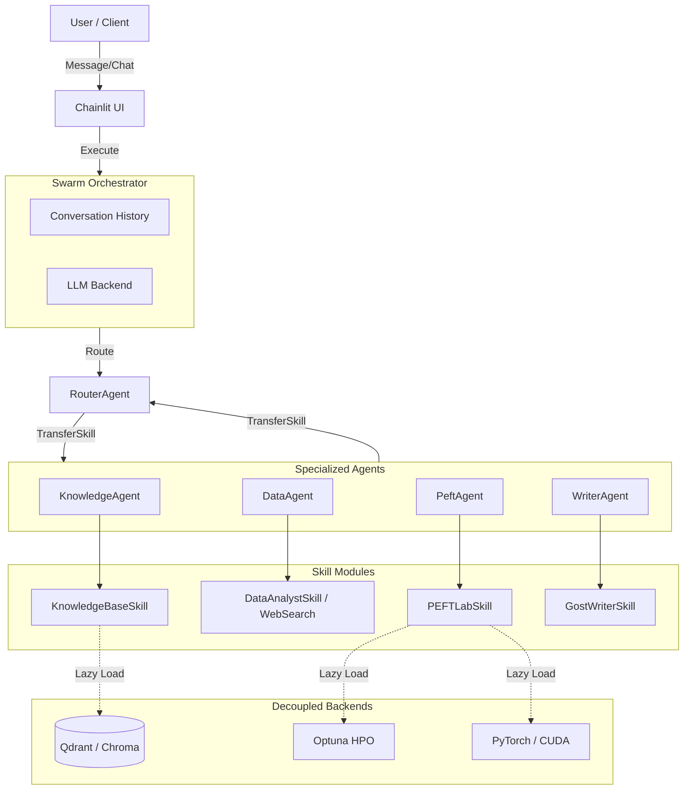
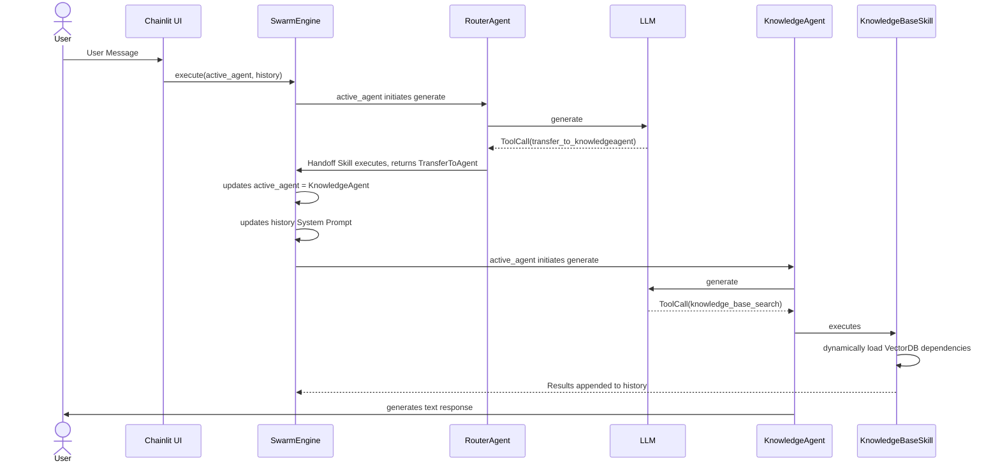

# Architecture

## High-Level Agent Architecture

## ⚡ Abstract Execution Flow

---

# Архитектура (Architecture)

## Высокоуровневая Архитектура Агента (Swarm)

*   **Swarm Engine**: Легковесный движок-оркестратор. Управляет историей диалога и бесшовно передает контекст между Агентами.
*   **RouterAgent**: Маршрутизатор. Анализирует запрос и решает, какому узкоспециализированному Агенту передать задачу.
*   **Specialized Agents**: 
    *   **KnowledgeAgent**: Владеет RAG (База знаний).
    *   **DataAgent**: Владеет аналитикой и веб-серфингом.
    *   **PeftAgent**: Владеет машинным обучением (PEFTlab, HPO).
    *   **WriterAgent**: Владеет форматированием ГОСТ.
*   **Skills (Навыки)**: Инструменты, которые привязаны к конкретному Агенту. Тяжелые зависимости (`chromadb`, `optuna`, `torch`) загружаются **лениво** (Lazy Load), чтобы не замедлять ядро.

---

## L8 Distinguished Guarantees, Invariants, & Constraints
The SGR Kernel architecture adheres to a rigorous set of formal invariants, specifically designed to survive adversarial conditions, noisy neighbors, and extreme contention:

*   **Eventual Progress Guarantees:** The system guarantees eventual progress under bounded contention $C$ despite up to 15% transaction abort rates under `SERIALIZABLE` DB isolation. This is enforced via strict max retry budgets with full jitter and fallback priority escalations.
*   **Admission Control (Multi-Dimensional DRF):** To prevent shared resource contention (e.g., GPU vs CPU workloads), Admission Control calculates quotas over a multi-dimensional resource vector (Dominant Resource Fairness) rather than relying on naive, uniform token buckets.
*   **SLO Isolation & Tail Amplification:** Explicit tail correlation modeling prevents storage/DB retries from geometrically amplifying total queue execution latencies, ensuring per-stage SLO limits.
*   **Failure Domain Decoupling:** The execution plane remains completely decoupled from DB availability during runtime. A database outage will only cause bounded execution duplication during recovery, never crashing in-flight compute nodes.
*   **Atomic S3 Protocol:** Because S3 pseudo-`RENAME` operations are inherently flawed (COPY+DELETE), atomic visibility relies strictly on versioned storage paths and atomic `_SUCCESS` commit markers.
*   **Formal Failure Model:** The system exclusively targets crash-stop resilience. It does not tolerate Byzantine errors, and it assumes eventual network and hardware recovery.

For an exhaustive architectural rationale, refer to:
*   [L8 Distinguished System Invariants](l8_distinguished_invariants.md)
*   [L8 Architecture Annex & Tradeoffs](L8_ARCHITECTURE_ANNEX.md)
