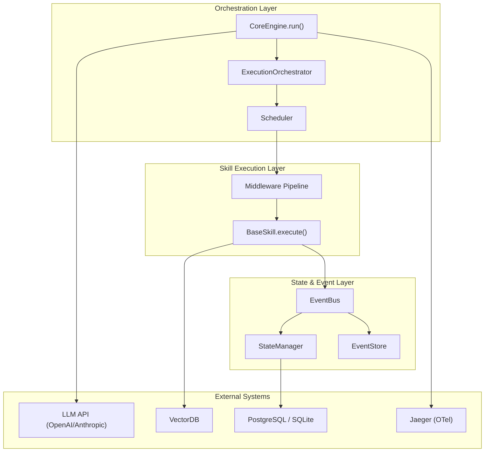

# 🧠 SGR Kernel — System Analyst Portfolio

> **Author**: Scar (scarseze)  
> **Project**: SGR Kernel — Middleware & Orchestration Engine for AI Agents  
> **Version**: 3.0.0 (Enterprise Swarm Tier)

---

## About the Project

SGR Kernel is an **AI Agent orchestration core** with formal correctness guarantees. Unlike most agent frameworks that optimize for prototyping speed, SGR Kernel optimizes for **predictability, security, and auditability**.

The kernel solves the main problem of distributed AI systems:

> "Did the task execute **correctly**, **exactly once**, amidst failures, retries, and network asynchrony?"

---

## Systems Analyst Skills Demonstrated in the Project

### 1. System Decomposition

The monolithic AI assistant is broken down into **isolated layers** with clear boundaries of responsibility:

| Layer | Components | Responsibility |
|:------|:-----------|:---------------|
| **Orchestration** | `SwarmEngine`, `ExecutionOrchestrator`, `Scheduler` | Task routing, DAG execution |
| **State & Events** | `EventBus`, `StateManager`, `EventStore` | Event Sourcing, deterministic mutations |
| **Skills** | `BaseSkill` ABC + 19 concrete implementations | Pluggable capabilities (DI) |
| **Security** | `SecurityGuardian`, `PIIClassifier`, `ComplianceEngine` | Defense-in-Depth |
| **Reliability** | `CircuitBreaker`, `CheckpointManager`, `CriticEngine` | Self-healing, HitL |

→ Read more: [Data Models](data_models.md) · [Event Catalog](event_catalog.md)

### 2. API & Contract Design

- **HTTP API**: 3 endpoints (FastAPI) with Pydantic validation, rate limiting, health checks
- **Internal Contracts**: `SkillExecutionContext` — formalized context for the middleware pipeline
- **LLM Integration**: Automatic mapping of `BaseSkill` → OpenAI Function Calling schema
- **Control Plane ↔ Data Plane**: `ExecutionSpec` — a specification that allows offloading tasks between workers

→ Read more: [API Contracts](api_contracts.md)

### 3. Event-Driven Architecture

- **13 event types** (Lifecycle, Step, Resource) with a complete catalog
- **Persistence-first**: events are saved to `EventStore` **before** subscribers process them
- **State Replay**: `StateManager.reconstruct(events)` rebuilds state from the event log
- **Idempotency**: `processed_event_ids` prevents duplicate processing

→ Read more: [Event Catalog](event_catalog.md)

### 4. Process Modeling

### 5. Formal Verification

6 TLA+ specifications that verified critical invariants:

| Specification | Invariant | States |
|:--------------|:----------|:------:|
| `LeaseProtocol.tla` | Execution Exclusivity | ~10K |
| `S3CommitProtocol.tla` | Atomic Visibility | ~20K |
| `SwarmLivelock.tla` | Eventual Progress | ~5K |
| `SchedulerReconciler.tla` | Queue Stability | ~5K |
| `EconomicBudgeting.tla` | Bounded Cost | ~5K |
| `ModelHandoff.tla` | Handoff Safety | ~5K |

**Total: 49,248 unique states verified, 0 deadlocks, 0 liveness violations.**

### 6. Security & Compliance Design

Multi-layered security (Defense-in-Depth):
- **Input**: `InputSanitizationLayer` (prompt injection defense)
- **Params**: `SecurityGuardian.validate_params()` (indirect injection)
- **Output**: PII masking, secret redaction
- **Context**: `ContextSanitizer` (agent handoff isolation)
- **Compliance**: 152-FZ, GDPR, HIPAA via `ComplianceEngine`

→ Read more: [Security Overview](security_overview.md)

### 7. Architecture Decision Records (ADR)

7 documented architectural decisions:

| ADR | Decision |
|:----|:---------|
| ADR-001 | Introduction of ADR practice |
| ADR-002 | Memory Decay & Conflict Resolution (Time Decay + LLM merge) |
| ADR-003 | Human-in-the-Loop Escalation (CriticEngine threshold) |
| ADR-004 | Distributed Observability (OpenTelemetry + Jaeger) |
| ADR-005 | CAS for Execution Token (optimistic locking) |
| ADR-006 | SQLite for Checkpoints (zero-ops vs PostgreSQL) |
| ADR-007 | Plan Critic before Execution (fail-fast validation) |

---

## Metrics

| Metric | Value |
|:-------|:------|
| **Tests** | 42/42 ✅ |
| **Coverage** | 82% |
| **TLA+ States** | 49,248 |
| **Deadlocks** | 0 |
| **Event Types** | 13 |
| **Middleware** | 5 |
| **Skills** | 19+ |
| **ADRs** | 7 |
| **Docs** | 36+ |

---

## Documentation

| Document | Description |
|:---------|:------------|
| [Event Catalog](event_catalog.md) | Event catalog, State Machine, Event Flow |
| [Data Models](data_models.md) | Pydantic models, Enums, Class Diagram |
| [API Contracts](api_contracts.md) | HTTP API, LLM mapping, Middleware Pipeline |
| [Security Overview](security_overview.md) | Defense-in-Depth, Compliance |
| [Architecture](../architecture.md) | C4 Level 1, Sequence Diagrams |
| [ADRs](../adr/) | 7 Architecture Decision Records |
| [TLA+ Specs](../../specifications/) | Formal specifications |
