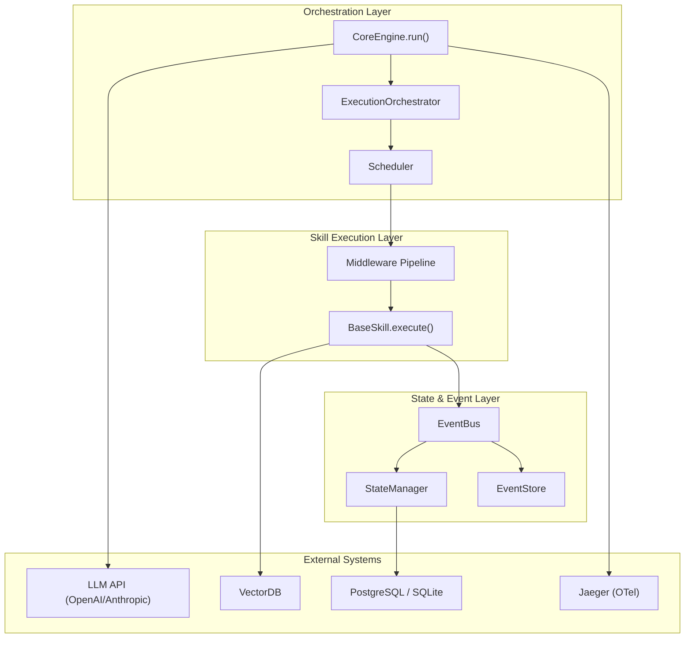

# 🧠 SGR Kernel — System Analyst Portfolio

> **Автор**: Scar (scarseze)  
> **Проект**: SGR Kernel — Middleware & Orchestration Engine for AI Agents  
> **Версия**: 3.0.0 (Enterprise Swarm Tier)

---

## О проекте

SGR Kernel — это **ядро оркестрации AI-агентов** с формальными гарантиями корректности. В отличие от большинства agent-фреймворков, оптимизирующих скорость прототипирования, SGR Kernel оптимизирует **предсказуемость, безопасность и аудитируемость**.

Ядро решает главный вопрос распределённых AI-систем:

> «Выполнилась ли задача **корректно**, **ровно один раз**, при сбоях, ретраях и сетевой асинхронности?»

---

## Навыки системного аналитика, продемонстрированные в проекте

### 1. System Decomposition (Декомпозиция системы)

Монолитный AI-ассистент разложен на **изолированные слои** с чёткими границами ответственности:

| Слой | Компоненты | Ответственность |
|:-----|:-----------|:---------------|
| **Orchestration** | `SwarmEngine`, `ExecutionOrchestrator`, `Scheduler` | Маршрутизация задач, DAG-выполнение |
| **State & Events** | `EventBus`, `StateManager`, `EventStore` | Event Sourcing, детерминированные мутации |
| **Skills** | `BaseSkill` ABC + 19 конкретных реализаций | Pluggable capabilities (DI) |
| **Security** | `SecurityGuardian`, `PIIClassifier`, `ComplianceEngine` | Defense-in-Depth |
| **Reliability** | `CircuitBreaker`, `CheckpointManager`, `CriticEngine` | Self-healing, HitL |

→ Подробнее: [Data Models](data_models.md) · [Event Catalog](event_catalog.md)

### 2. API & Contract Design (Проектирование API)

- **HTTP API**: 3 эндпоинта (FastAPI) с Pydantic-валидацией, rate limiting, health checks
- **Internal Contracts**: `SkillExecutionContext` — формализованный контекст middleware pipeline
- **LLM Integration**: Автоматический маппинг `BaseSkill` → OpenAI Function Calling schema
- **Control Plane ↔ Data Plane**: `ExecutionSpec` — спецификация, позволяющая переносить задачи между воркерами

→ Подробнее: [API Contracts](api_contracts.md)

### 3. Event-Driven Architecture (Событийная архитектура)

- **13 типов событий** (Lifecycle, Step, Resource) с полным каталогом
- **Persistence-first**: события сохраняются в `EventStore` **до** обработки подписчиками
- **State Replay**: `StateManager.reconstruct(events)` воссоздаёт состояние из лога
- **Idempotency**: `processed_event_ids` предотвращает дублирование обработки

→ Подробнее: [Event Catalog](event_catalog.md)

### 4. Process Modeling (Моделирование процессов)

### 5. Formal Verification (Формальная верификация)

6 TLA+ спецификаций, верифицировавших критические инварианты:

| Спецификация | Инвариант | Состояний |
|:-------------|:----------|:---------:|
| `LeaseProtocol.tla` | Execution Exclusivity | ~10K |
| `S3CommitProtocol.tla` | Atomic Visibility | ~20K |
| `SwarmLivelock.tla` | Eventual Progress | ~5K |
| `SchedulerReconciler.tla` | Queue Stability | ~5K |
| `EconomicBudgeting.tla` | Bounded Cost | ~5K |
| `ModelHandoff.tla` | Handoff Safety | ~5K |

**Итого: 49 248 уникальных состояний, 0 deadlocks, 0 liveness violations.**

### 6. Security & Compliance Design

Многослойная безопасность (Defense-in-Depth):
- **Input**: `InputSanitizationLayer` (prompt injection defense)
- **Params**: `SecurityGuardian.validate_params()` (indirect injection)
- **Output**: PII masking, secret redaction
- **Context**: `ContextSanitizer` (agent handoff isolation)
- **Compliance**: 152-ФЗ, GDPR, HIPAA через `ComplianceEngine`

→ Подробнее: [Security Overview](security_overview.md)

### 7. Architecture Decision Records (ADR)

7 документированных архитектурных решений:

| ADR | Решение |
|:----|:--------|
| ADR-001 | Внедрение практики ADR |
| ADR-002 | Memory Decay & Conflict Resolution (Time Decay + LLM merge) |
| ADR-003 | Human-in-the-Loop Escalation (CriticEngine threshold) |
| ADR-004 | Distributed Observability (OpenTelemetry + Jaeger) |
| ADR-005 | CAS для Execution Token (optimistic locking) |
| ADR-006 | SQLite для Checkpoints (zero-ops vs PostgreSQL) |
| ADR-007 | Plan Critic перед Execution (fail-fast validation) |

---

## Метрики

| Метрика | Значение |
|:--------|:---------|
| **Тесты** | 42/42 ✅ |
| **Покрытие** | 82% |
| **TLA+ состояния** | 49 248 |
| **Deadlocks** | 0 |
| **Типы событий** | 13 |
| **Middleware** | 5 |
| **Skills** | 19+ |
| **ADR** | 7 |
| **Docs** | 36+ |

---

## Документация

| Документ | Описание |
|:---------|:---------|
| [Event Catalog](event_catalog.md) | Каталог событий, State Machine, Event Flow |
| [Data Models](data_models.md) | Pydantic-модели, Enums, Class Diagram |
| [API Contracts](api_contracts.md) | HTTP API, LLM маппинг, Middleware Pipeline |
| [Security Overview](security_overview.md) | Defense-in-Depth, Compliance |
| [Architecture](../architecture.md) | C4 Level 1, Sequence Diagrams |
| [ADRs](../adr/) | 7 Architecture Decision Records |
| [TLA+ Specs](../../specifications/) | Формальные спецификации |
