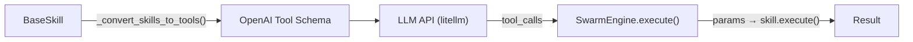
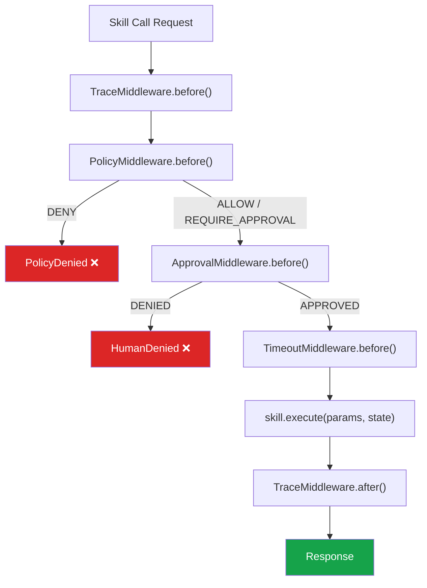

# API Contracts — SGR Kernel

> **Version**: 3.0 | **Source**: [`server.py`](file:///c:/Users/macht/SA/sgr_kernel/server.py), [`core/swarm.py`](file:///c:/Users/macht/SA/sgr_kernel/core/swarm.py)

---

## HTTP API (FastAPI)

### `POST /api/v1/chat`

Main endpoint for processing user queries.

**Request:**
```json
{
  "query": "Find information about PEFT methods for Mamba",
  "context": {"session_id": "abc-123", "locale": "en"},
  "source_app": "webui"
}
```

| Field | Type | Required | Description |
|:------|:-----|:---:|:------------|
| `query` | `string` | ✅ | User's query text |
| `context` | `object` | ❌ | Additional context (session, locale) |
| `source_app` | `string` | ❌ | Source: `"webui"`, `"telegram"`, `"cli"`, `"unknown"` |

**Response (200):**
```json
{
  "result": "Based on the internal knowledge base search results..."
}
```

**Error Responses:**

| Code | Reason |
|:-----|:-------|
| `400` | Invalid JSON / empty request |
| `429` | Rate Limit exceeded (>60 req/min) |
| `500` | Internal kernel error |
| `503` | Kernel not initialized |

---

### `GET /health/db`

Liveness probe for database connections.

**Response (200):**
```json
{
  "status": "healthy",
  "db_type": "sqlite",
  "tables": ["sessions", "messages", "events"]
}
```

**Response (503):**
```json
{
  "status": "unhealthy",
  "error": "Connection refused"
}
```

---

### `GET /health/swarm_topology`

Health check + Swarm topology introspection.

**Response (200):**
```json
{
  "status": "healthy",
  "agent_count": 5,
  "agents": [
    {
      "name": "RouterAgent",
      "skills": ["handoff_to_knowledge", "handoff_to_data"],
      "model": "deepseek-chat"
    },
    {
      "name": "KnowledgeAgent",
      "skills": ["knowledge_base_search"],
      "model": "deepseek-chat"
    }
  ],
  "cached": true,
  "cache_ttl_sec": 30
}
```

> [!NOTE]
> The result is cached for 30 seconds to prevent excessive monitoring requests.

---

## Rate Limiting

Implemented via `RateLimitMiddleware` (Starlette BaseHTTPMiddleware):

| Parameter | Value |
|:----------|:------|
| Window | 60 seconds |
| Limit | 60 requests/min |
| Algorithm | Fixed Window (in-memory dict) |
| Scope | Per-IP (`request.client.host`) |
| Response | `429 Too Many Requests` |

---

## Skill → LLM Function Calling (Internal Contract)

SGR Kernel maps every `BaseSkill` to the **OpenAI Function Calling** format for transmission to the LLM:



**Mapping:**

| BaseSkill property | OpenAI Tool field |
|:-------------------|:------------------|
| `skill.name` | `function.name` |
| `skill.description` | `function.description` |
| `skill.input_schema.model_json_schema()` | `function.parameters` |

**Generated Tool Example:**
```json
{
  "type": "function",
  "function": {
    "name": "knowledge_base_search",
    "description": "Search internal knowledge base (RAG)",
    "parameters": {
      "type": "object",
      "properties": {
        "query": {"type": "string", "description": "Search query"},
        "top_k": {"type": "integer", "default": 5}
      },
      "required": ["query"]
    }
  }
}
```

---

## Middleware Pipeline (Internal Contract)

Every skill execution flows through a middleware pipeline:



| Middleware | Purpose | Can interrupt? |
|:-----------|:--------|:---:|
| `TraceMiddleware` | OpenTelemetry span start/stop | ❌ |
| `PolicyMiddleware` | ACL check (risk, cost, capability) | ✅ `PolicyDenied` |
| `ApprovalMiddleware` | HitL request to operator | ✅ `HumanDenied` |
| `TimeoutMiddleware` | Sets `ctx.timeout` from `metadata.timeout_sec` | ❌ |
| `RetryMiddleware` | Execution retry logic | ❌ |
