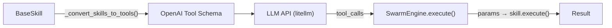
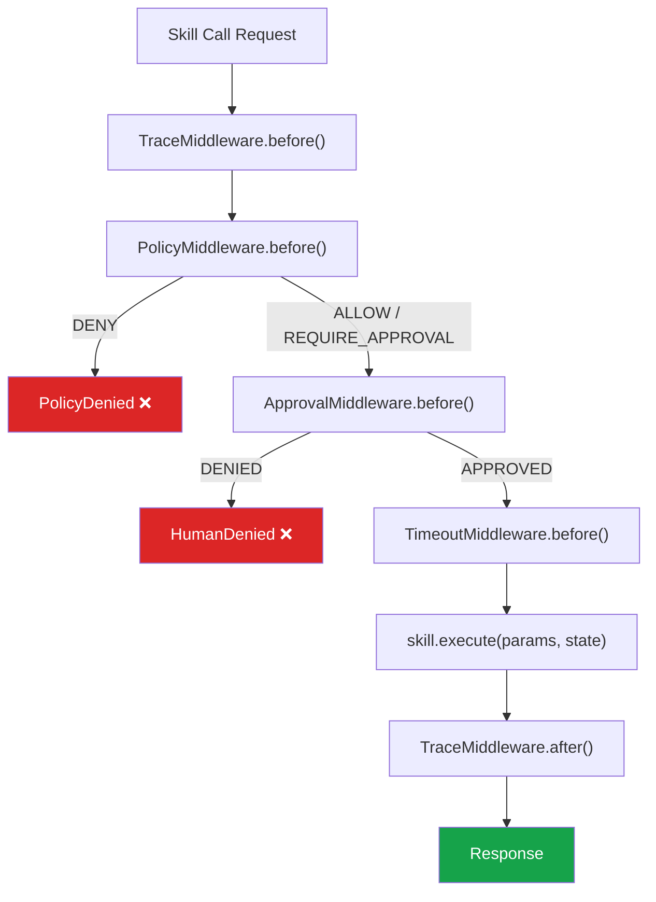

# API Contracts — SGR Kernel

> **Версия**: 3.0 | **Источник**: [`server.py`](file:///c:/Users/macht/SA/sgr_kernel/server.py), [`core/swarm.py`](file:///c:/Users/macht/SA/sgr_kernel/core/swarm.py)

---

## HTTP API (FastAPI)

### `POST /api/v1/chat`

Основной эндпоинт обработки запросов пользователя.

**Request:**
```json
{
  "query": "Найди информацию о PEFT-методах для Mamba",
  "context": {"session_id": "abc-123", "locale": "ru"},
  "source_app": "webui"
}
```

| Поле | Тип | Обязательность | Описание |
|:-----|:----|:---:|:---------|
| `query` | `string` | ✅ | Текст запроса пользователя |
| `context` | `object` | ❌ | Дополнительный контекст (session, locale) |
| `source_app` | `string` | ❌ | Источник: `"webui"`, `"telegram"`, `"cli"`, `"unknown"` |

**Response (200):**
```json
{
  "result": "По результатам поиска в базе знаний..."
}
```

**Error Responses:**

| Code | Причина |
|:-----|:--------|
| `400` | Невалидный JSON / пустой запрос |
| `429` | Rate Limit превышен (>60 req/min) |
| `500` | Внутренняя ошибка ядра |
| `503` | Ядро не инициализировано |

---

### `GET /health/db`

Liveness probe для подключения к базе данных.

**Response (200):**
```json
{
  "status": "healthy",
  "db_type": "sqlite",
  "tables": ["sessions", "messages", "events"]
}
```

**Response (503):**
```json
{
  "status": "unhealthy",
  "error": "Connection refused"
}
```

---

### `GET /health/swarm_topology`

Health-check + интроспекция топологии Swarm.

**Response (200):**
```json
{
  "status": "healthy",
  "agent_count": 5,
  "agents": [
    {
      "name": "RouterAgent",
      "skills": ["handoff_to_knowledge", "handoff_to_data"],
      "model": "deepseek-chat"
    },
    {
      "name": "KnowledgeAgent",
      "skills": ["knowledge_base_search"],
      "model": "deepseek-chat"
    }
  ],
  "cached": true,
  "cache_ttl_sec": 30
}
```

> [!NOTE]
> Результат кэшируется на 30 секунд для защиты от избыточных запросов мониторинга.

---

## Rate Limiting

Реализован через `RateLimitMiddleware` (Starlette BaseHTTPMiddleware):

| Параметр | Значение |
|:---------|:---------|
| Окно | 60 секунд |
| Лимит | 60 запросов/мин |
| Алгоритм | Fixed Window (in-memory dict) |
| Scope | Per-IP (`request.client.host`) |
| Response | `429 Too Many Requests` |

---

## Skill → LLM Function Calling (внутренний контракт)

SGR Kernel маппит каждый `BaseSkill` в формат **OpenAI Function Calling** для передачи в LLM:



**Маппинг:**

| BaseSkill property | OpenAI Tool field |
|:-------------------|:------------------|
| `skill.name` | `function.name` |
| `skill.description` | `function.description` |
| `skill.input_schema.model_json_schema()` | `function.parameters` |

**Пример сгенерированного Tool:**
```json
{
  "type": "function",
  "function": {
    "name": "knowledge_base_search",
    "description": "Поиск по внутренней базе знаний (RAG)",
    "parameters": {
      "type": "object",
      "properties": {
        "query": {"type": "string", "description": "Поисковый запрос"},
        "top_k": {"type": "integer", "default": 5}
      },
      "required": ["query"]
    }
  }
}
```

---

## Middleware Pipeline (внутренний контракт)

Каждый вызов скилла проходит через цепочку middleware:



| Middleware | Назначение | Может прервать? |
|:-----------|:-----------|:---:|
| `TraceMiddleware` | Старт/стоп OpenTelemetry span | ❌ |
| `PolicyMiddleware` | ACL-проверка (risk, cost, capability) | ✅ `PolicyDenied` |
| `ApprovalMiddleware` | HitL-запрос у оператора | ✅ `HumanDenied` |
| `TimeoutMiddleware` | Установка `ctx.timeout` из `metadata.timeout_sec` | ❌ |
| `RetryMiddleware` | Логика повторных попыток | ❌ |
