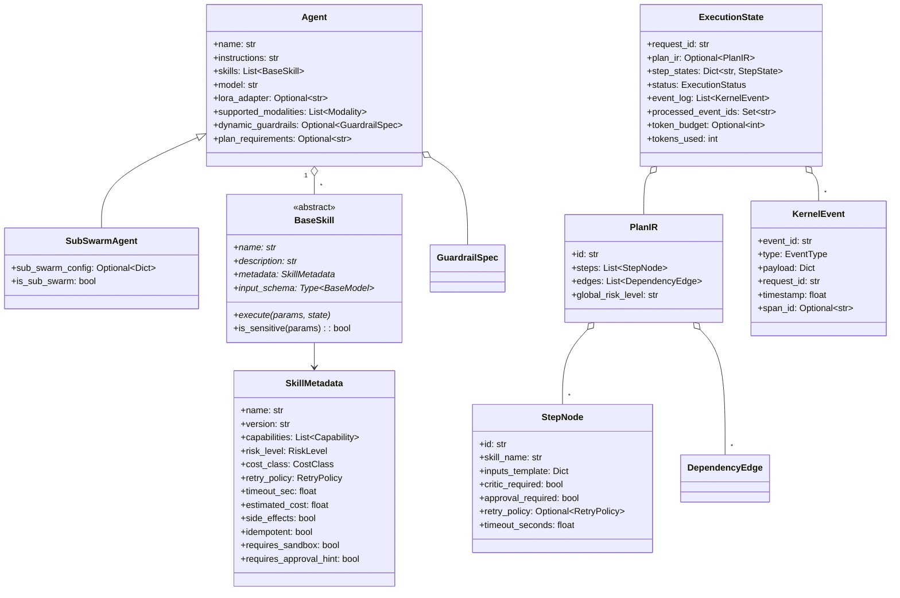
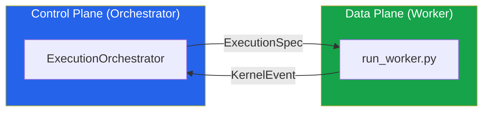

# Data Models — SGR Kernel

> **Version**: 3.0 | **Sources**: [`core/types.py`](file:///c:/Users/macht/SA/sgr_kernel/core/types.py), [`core/agent.py`](file:///c:/Users/macht/SA/sgr_kernel/core/agent.py), [`core/execution/__init__.py`](file:///c:/Users/macht/SA/sgr_kernel/core/execution/__init__.py)

All data models are implemented as **Pydantic BaseModels** ensuring runtime validation, JSON serialization, and auto-generated schemas.

---

## Model Hierarchy

---

## Enums

### ExecutionStatus — Global Execution FSM
| Value | Description |
|:------|:------------|
| `CREATED` | Request received, plan not yet generated |
| `PLANNED` | Plan IR created, waiting for execution |
| `RUNNING` | Active DAG execution in progress |
| `PAUSED_APPROVAL` | Waiting for human-in-the-loop approval |
| `REPAIRING` | Automatic repair of a failed step |
| `ESCALATING` | Escalating to a more capable LLM tier |
| `COMPLETED` | All steps successfully finished |
| `FAILED` | Unrecoverable failure |
| `ABORTED` | Manually aborted |

### StepStatus — Individual Step FSM
| Value | Description |
|:------|:------------|
| `PENDING` | Waiting for dependencies |
| `READY` | Dependencies resolved |
| `RUNNING` | Actively executing |
| `VALIDATING` | Output validation in progress |
| `CRITIC` | Semantic check by CriticEngine |
| `REPAIR` | Automatic repair via LLM retry |
| `APPROVAL` | HitL human approval needed |
| `COMMITTED` | Successfully finished |
| `FAILED` | Execution failed completely |
| `RETRY_WAIT` | Pending retry due to transient error |

### SemanticFailureType
| Value | Description |
|:------|:------------|
| `SCHEMA_FAIL` | Output does not match expected JSON schema |
| `CRITIC_FAIL` | CriticEngine rejected the result |
| `LOW_CONFIDENCE` | LLM self-reported low confidence |
| `TIMEOUT` | Time limit exceeded |
| `TOOL_ERROR` | Error executing tool / skill |
| `CAPABILITY_VIOLATION` | Skill lacks required capability flag |
| `CONSTRAINT_VIOLATION` | Business constraint violation |
| `POLICY_VIOLATION` | Rejected by PolicyEngine |

### Capability
`REASONING` · `WEB` · `FILESYSTEM` · `DB` · `CODE` · `API` · `LLM` · `PLANNING` · `REPORT_WRITING`

### RiskLevel / CostClass
`LOW` / `MEDIUM` / `HIGH` — `CHEAP` / `NORMAL` / `EXPENSIVE`

---

## Control Plane ↔ Data Plane Contract

**ExecutionSpec** — formal task specification generated by the Control Plane:

| Field | Type | Purpose |
|:------|:-----|:--------|
| `image_ref` | `str` | Docker/OCI image (`sgr-peftlab:v2.1`) |
| `resource_limits` | `Dict` | `{cpu: 4, gpu: 1, ram: "16Gi"}` |
| `input_uri` | `Optional[str]` | Immutable URI for input data |
| `output_uri` | `Optional[str]` | Deterministic URI for artifacts |
| `retry_policy` | `Dict` | `{max_retries: 3, backoff: "exponential"}` |
| `cost_tier` | `str` | `SPOT` or `ONDEMAND` |
| `trace_context` | `Dict[str, str]` | OpenTelemetry `trace_id` + `span_id` |

---

## Middleware Pipeline Context

**SkillExecutionContext** — object passed throughout the middleware pipeline:

| Field | Type | Purpose |
|:------|:-----|:--------|
| `request_id` | `str` | Correlation with global request |
| `step_id` | `str` | ID of the current running step |
| `skill_name` | `str` | Skill being executed |
| `params` | `Dict` | Validated parameter inputs |
| `state` | `ExecutionState` | Global execution state |
| `metadata` | `SkillMetadata` | Skill metadata (timeout, risk, etc.) |
| `trace` | `StepTrace` | Telemetry tracing context |
| `attempt` | `int` | Attempt number (1-based) |
| `timeout` | `float` | Handled **exclusively** by `TimeoutMiddleware` |
| `llm` | `Optional[LLMService]` | Router-selected LLM instance |
