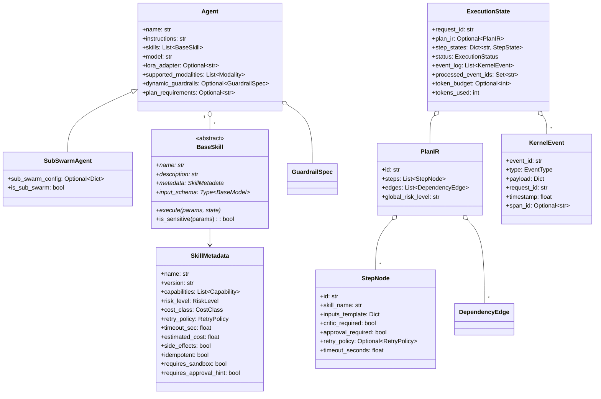
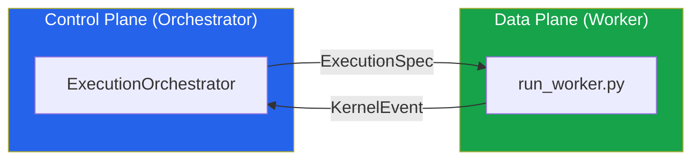

# Data Models — SGR Kernel

> **Версия**: 3.0 | **Источники**: [`core/types.py`](file:///c:/Users/macht/SA/sgr_kernel/core/types.py), [`core/agent.py`](file:///c:/Users/macht/SA/sgr_kernel/core/agent.py), [`core/execution/__init__.py`](file:///c:/Users/macht/SA/sgr_kernel/core/execution/__init__.py)

Все модели данных реализованы как **Pydantic BaseModel** с runtime-валидацией, JSON-сериализацией и автогенерацией schema.

---

## Иерархия моделей

---

## Enums (перечисления)

### ExecutionStatus — FSM глобального выполнения
| Значение | Описание |
|:---------|:---------|
| `CREATED` | Запрос принят, план ещё не сгенерирован |
| `PLANNED` | Plan IR создан, ожидание запуска |
| `RUNNING` | Активное выполнение DAG |
| `PAUSED_APPROVAL` | Ожидание human-in-the-loop подтверждения |
| `REPAIRING` | Автоматическое исправление провалившегося шага |
| `ESCALATING` | Эскалация на более тяжёлую LLM-модель |
| `COMPLETED` | Все шаги успешно завершены |
| `FAILED` | Невосстановимый сбой |
| `ABORTED` | Ручная отмена |

### StepStatus — FSM отдельного шага
| Значение | Описание |
|:---------|:---------|
| `PENDING` | Ожидание зависимостей |
| `READY` | Зависимости удовлетворены |
| `RUNNING` | Активное выполнение |
| `VALIDATING` | Проверка выходных данных |
| `CRITIC` | Семантическая проверка CriticEngine |
| `REPAIR` | Автоматическое исправление |
| `APPROVAL` | HitL-подтверждение |
| `COMMITTED` | Успешно завершён |
| `FAILED` | Провален |
| `RETRY_WAIT` | Ожидание повторной попытки |

### SemanticFailureType — классификация отказов
| Значение | Описание |
|:---------|:---------|
| `SCHEMA_FAIL` | Выход не соответствует JSON-схеме |
| `CRITIC_FAIL` | CriticEngine отклонил результат |
| `LOW_CONFIDENCE` | Низкая уверенность LLM |
| `TIMEOUT` | Превышен лимит времени |
| `TOOL_ERROR` | Ошибка вызова инструмента |
| `CAPABILITY_VIOLATION` | Скилл не имеет требуемой capability |
| `CONSTRAINT_VIOLATION` | Нарушение бизнес-ограничения |
| `POLICY_VIOLATION` | Отклонено PolicyEngine |

### Capability — возможности скиллов
`REASONING` · `WEB` · `FILESYSTEM` · `DB` · `CODE` · `API` · `LLM` · `PLANNING` · `REPORT_WRITING`

### RiskLevel / CostClass
`LOW` / `MEDIUM` / `HIGH` — `CHEAP` / `NORMAL` / `EXPENSIVE`

---

## Control Plane ↔ Data Plane контракт

**ExecutionSpec** — формальная спецификация задачи, генерируемая Control Plane:

| Поле | Тип | Назначение |
|:-----|:----|:-----------|
| `image_ref` | `str` | Docker/OCI образ (`sgr-peftlab:v2.1`) |
| `resource_limits` | `Dict` | `{cpu: 4, gpu: 1, ram: "16Gi"}` |
| `input_uri` | `Optional[str]` | Immutable URI входных данных |
| `output_uri` | `Optional[str]` | Детерминированный URI для артефактов |
| `retry_policy` | `Dict` | `{max_retries: 3, backoff: "exponential"}` |
| `cost_tier` | `str` | `SPOT` или `ONDEMAND` |
| `trace_context` | `Dict[str, str]` | OpenTelemetry `trace_id` + `span_id` |

---

## Middleware Pipeline Context

**SkillExecutionContext** — объект, передаваемый через цепочку middleware:

| Поле | Тип | Назначение |
|:-----|:----|:-----------|
| `request_id` | `str` | Корреляция с глобальным запросом |
| `step_id` | `str` | ID текущего шага |
| `skill_name` | `str` | Имя вызываемого скилла |
| `params` | `Dict` | Валидированные параметры |
| `state` | `ExecutionState` | Глобальное состояние |
| `metadata` | `SkillMetadata` | Метаданные скилла (timeout, risk, etc.) |
| `trace` | `StepTrace` | Трейсинг-контекст |
| `attempt` | `int` | Номер попытки (1-based) |
| `timeout` | `float` | Устанавливается **только** `TimeoutMiddleware` |
| `llm` | `Optional[LLMService]` | Router-selected LLM instance |
