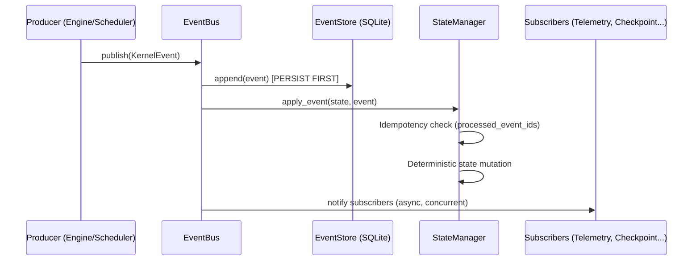
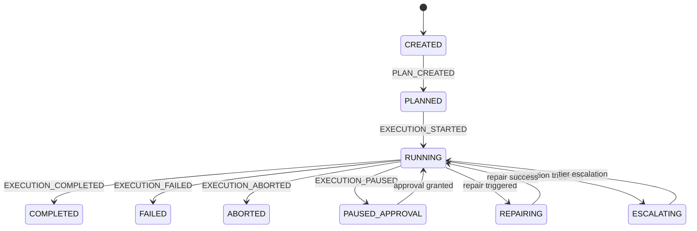
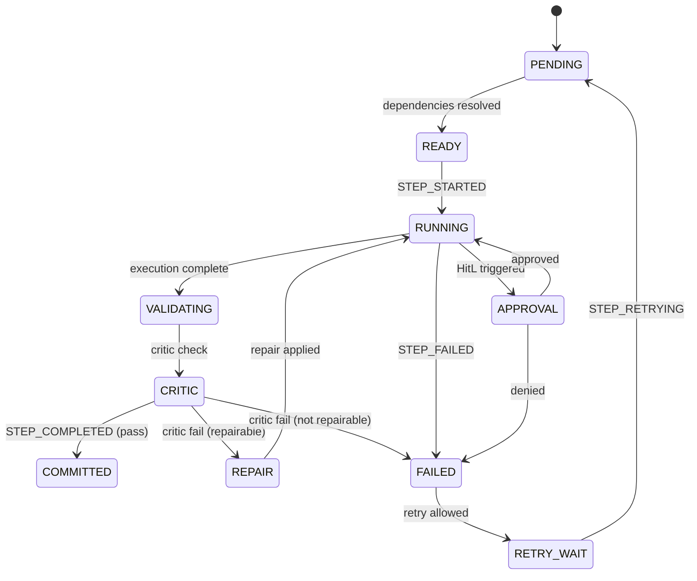

# Event Catalog — SGR Kernel

> **Version**: 3.0 | **Source**: [`core/events.py`](file:///c:/Users/macht/SA/sgr_kernel/core/events.py), [`core/state_manager.py`](file:///c:/Users/macht/SA/sgr_kernel/core/state_manager.py)

SGR Kernel is built on an **Event-Driven Architecture**. Every state change occurs **only** through publishing an event to the `EventBus`. The `StateManager` is subscribed to all events and deterministically mutates the `ExecutionState`.

---

## Event Structure (`KernelEvent`)

```python
class KernelEvent(BaseModel):
    event_id: str           # UUID, unique identifier
    type: EventType         # Event type (see catalog below)
    payload: Dict[str, Any] # Type-specific data
    request_id: str         # Request ID (correlation)
    timestamp: float        # Creation time (Unix)
    step_id: Optional[str]  # For step-level events
    actor: str              # "kernel" | "scheduler" | "orchestrator"
    span_id: Optional[str]          # OpenTelemetry span
    parent_event_id: Optional[str]  # Causal chain
    correlation_id: Optional[str]   # For distributed tracing
```

---

## Event Catalog

### Lifecycle Events

| Event | Producer | `ExecutionState` Mutation | Payload |
|:------|:---------|:--------------------------|:--------|
| `PLAN_CREATED` | `CoreEngine._generate_plan()` | `status → PLANNED`, init `step_states` | `{plan_ir: PlanIR}` |
| `EXECUTION_STARTED` | `CoreEngine.run()` | `status → RUNNING` | `{}` |
| `EXECUTION_COMPLETED` | `ExecutionOrchestrator.execute()` | `status → COMPLETED` | `{}` |
| `EXECUTION_FAILED` | `ExecutionOrchestrator.execute()` | `status → FAILED` | `{error: str}` |
| `EXECUTION_ABORTED` | `CoreEngine.abort()` | `status → ABORTED` | `{reason: str}` |
| `EXECUTION_PAUSED` | `ApprovalMiddleware` | `status → PAUSED_APPROVAL` | `{step_id: str}` |

### Step Events

| Event | Producer | `StepState` Mutation | Payload |
|:------|:---------|:---------------------|:--------|
| `STEP_SCHEDULED` | `Scheduler` | *(logging)* | `{step_id: str}` |
| `STEP_STARTED` | `StepLifecycleEngine` | `status → RUNNING`, `started_at = ts` | `{attempt: int}` |
| `STEP_COMPLETED` | `StepLifecycleEngine` | `status → COMMITTED`, `output = ...` | `{output: Any}` |
| `STEP_FAILED` | `StepLifecycleEngine` | `status → FAILED`, `failure = ...` | `{failure: FailureRecord}` |
| `STEP_RETRYING` | `StepLifecycleEngine` | `status → PENDING`, clear `finished_at` | `{attempt: int}` |
| `STEP_VALIDATING` | `CriticEngine` | *(logging)* | `{validator: str}` |

### Resource Events

| Event | Producer | Purpose |
|:------|:---------|:--------|
| `CHECKPOINT_SAVED` | `CheckpointManager` | Commits recovery point |
| `TELEMETRY_RECORDED` | `TelemetryCollector` | Performance metrics |
| `LEARNING_SIGNAL` | `LearningModule` | Feedback for self-improvement |

---

## Event Flow



**Key Invariant**: EventStore receives the event **before** any state mutation. This guarantees replayability even during a crash.

---

## State Machine: ExecutionStatus



## State Machine: StepStatus



---

## Guarantees

| Property | Mechanism |
|:---------|:----------|
| **Idempotency** | `processed_event_ids` in `ExecutionState` — duplicate events are ignored |
| **Persistence-first** | `EventBus.publish()` writes to `EventStore` **before** calling subscribers |
| **Replay** | `StateManager.reconstruct(events)` rebuilds state from the event log |
| **Determinism** | Mutations are strictly defined by `event.type` + `event.payload` (no side effects) |
| **Causal ordering** | `parent_event_id` and `correlation_id` enable causal tracing |
