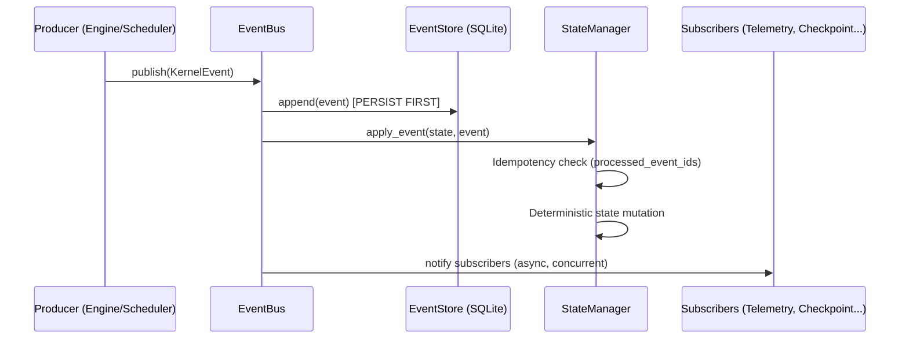
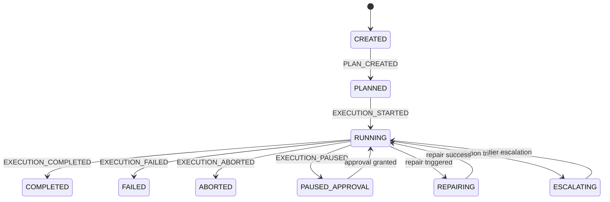
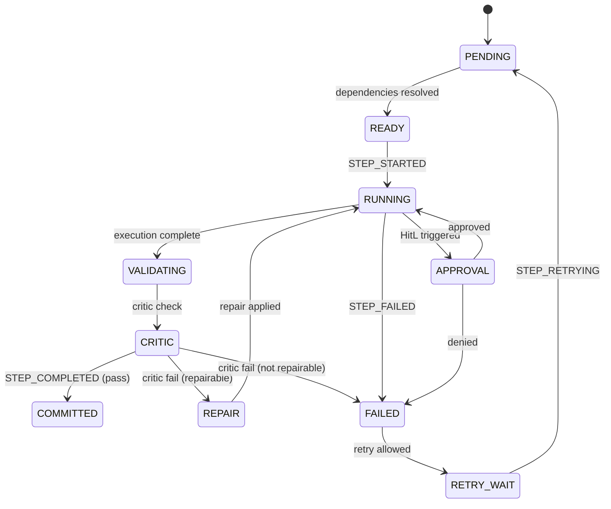

# Event Catalog — SGR Kernel

> **Версия**: 3.0 | **Источник**: [`core/events.py`](file:///c:/Users/macht/SA/sgr_kernel/core/events.py), [`core/state_manager.py`](file:///c:/Users/macht/SA/sgr_kernel/core/state_manager.py)

SGR Kernel построен на **Event-Driven Architecture**. Каждое изменение состояния происходит **только** через публикацию события в `EventBus`. `StateManager` подписан на все события и детерминированно мутирует `ExecutionState`.

---

## Структура события (`KernelEvent`)

```python
class KernelEvent(BaseModel):
    event_id: str           # UUID, уникальный идентификатор
    type: EventType         # Тип события (см. таблицу ниже)
    payload: Dict[str, Any] # Данные, специфичные для типа
    request_id: str         # ID запроса (корреляция)
    timestamp: float        # Время создания (Unix)
    step_id: Optional[str]  # Для step-level событий
    actor: str              # "kernel" | "scheduler" | "orchestrator"
    span_id: Optional[str]          # OpenTelemetry span
    parent_event_id: Optional[str]  # Каузальная цепочка
    correlation_id: Optional[str]   # Для distributed tracing
```

---

## Каталог событий

### Lifecycle Events (Жизненный цикл выполнения)

| Event | Продюсер | Мутация `ExecutionState` | Payload |
|:------|:---------|:------------------------|:--------|
| `PLAN_CREATED` | `CoreEngine._generate_plan()` | `status → PLANNED`, инициализация `step_states` | `{plan_ir: PlanIR}` |
| `EXECUTION_STARTED` | `CoreEngine.run()` | `status → RUNNING` | `{}` |
| `EXECUTION_COMPLETED` | `ExecutionOrchestrator.execute()` | `status → COMPLETED` | `{}` |
| `EXECUTION_FAILED` | `ExecutionOrchestrator.execute()` | `status → FAILED` | `{error: str}` |
| `EXECUTION_ABORTED` | `CoreEngine.abort()` | `status → ABORTED` | `{reason: str}` |
| `EXECUTION_PAUSED` | `ApprovalMiddleware` | `status → PAUSED_APPROVAL` | `{step_id: str}` |

### Step Events (События шагов)

| Event | Продюсер | Мутация `StepState` | Payload |
|:------|:---------|:-------------------|:--------|
| `STEP_SCHEDULED` | `Scheduler` | *(логирование)* | `{step_id: str}` |
| `STEP_STARTED` | `StepLifecycleEngine` | `status → RUNNING`, `started_at = ts` | `{attempt: int}` |
| `STEP_COMPLETED` | `StepLifecycleEngine` | `status → COMMITTED`, `output = ...` | `{output: Any}` |
| `STEP_FAILED` | `StepLifecycleEngine` | `status → FAILED`, `failure = ...` | `{failure: FailureRecord}` |
| `STEP_RETRYING` | `StepLifecycleEngine` | `status → PENDING`, сброс `finished_at` | `{attempt: int}` |
| `STEP_VALIDATING` | `CriticEngine` | *(логирование)* | `{validator: str}` |

### Resource Events (Инфраструктурные)

| Event | Продюсер | Назначение |
|:------|:---------|:-----------|
| `CHECKPOINT_SAVED` | `CheckpointManager` | Фиксация точки восстановления |
| `TELEMETRY_RECORDED` | `TelemetryCollector` | Метрики производительности |
| `LEARNING_SIGNAL` | `LearningModule` | Обратная связь для self-improvement |

---

## Поток событий (Event Flow)



**Ключевой инвариант**: EventStore получает событие **перед** любой мутацией состояния. Это гарантирует возможность replay даже при сбое.

---

## Машина состояний: ExecutionStatus



## Машина состояний: StepStatus



---

## Гарантии

| Свойство | Механизм |
|:---------|:---------|
| **Idempotency** | `processed_event_ids` в `ExecutionState` — дублирующие события игнорируются |
| **Persistence-first** | `EventBus.publish()` записывает в `EventStore` **до** вызова подписчиков |
| **Replay** | `StateManager.reconstruct(events)` воссоздаёт состояние из лога событий |
| **Determinism** | Мутации строго определяются `event.type` + `event.payload`, без побочных эффектов |
| **Causal ordering** | `parent_event_id` и `correlation_id` обеспечивают каузальную трассировку |
