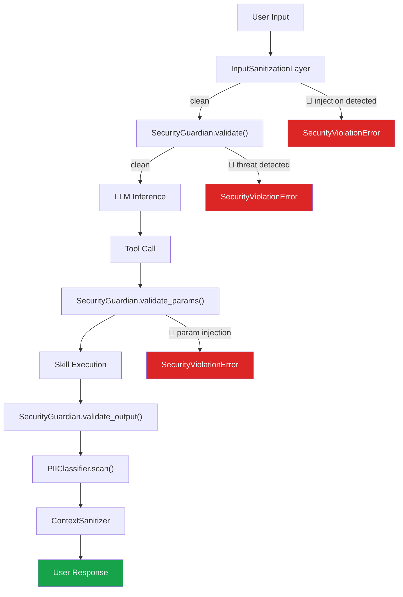

# Security & Compliance — SGR Kernel

> **Version**: 3.0 | **Sources**: [`core/security.py`](file:///c:/Users/macht/SA/sgr_kernel/core/security.py), [`core/pii_classifier.py`](file:///c:/Users/macht/SA/sgr_kernel/core/pii_classifier.py), [`core/compliance/`](file:///c:/Users/macht/SA/sgr_kernel/core/compliance)

---

## Security Architecture

SGR Kernel utilizes a **Defense-in-Depth** approach out of the box — providing multi-layered protection on inputs, parameters, outputs, and context passing:

---

## Components

### 1. InputSanitizationLayer

The **first line of defense** — a heuristic filter executed before any data reaches the LLM.

| Feature | Description |
|:--------|:------------|
| Prompt Injection | Detects `ignore previous instructions`, `system:`, nested jailbreaks |
| Input length bounds | Hard cap at 15,000 characters by default (configurable) |
| Encoding bypass | Detects Base64, hex-encoded hidden commands |

**Exception triggered:** `SecurityViolationError`

### 2. SecurityGuardian

**The core security module** acting via heavily audited regex pattern matching (9.7 KB of logic).

#### Restricted Input Patterns (BLOCK_PATTERNS):

| Category | Examples |
|:---------|:---------|
| **Exfiltration & Obfuscation** | `curl`, `wget`, `base64`, `exec()`, `eval()` |
| **Code Injection** | `__import__`, `subprocess`, `os.system` |
| **Prompt Manipulation** | `ignore previous`, `new instructions`, system prompt override |
| **File System Access** | `../../`, path traversal, `rm -rf` |
| **Credential Exposure** | API keys, tokens, passwords in output |

#### Three points of validation:

1. **`validate(input_text)`** — checks user input text
2. **`validate_params(params)`** — checks tool parameters (protects against indirect injection via template variables)
3. **`validate_output(output)`** — output sanitization, secret masking

### 3. PIIClassifier

**Classification and redaction of PII (Personally Identifiable Information)** (5.2 KB).

| PII Type | Pattern | Masking Output |
|:---------|:--------|:---------------|
| Email | `user@domain.com` | `[PII:EMAIL]` |
| Phone | `+1-800-...` | `[PII:PHONE]` |
| SSN / Tax IDs | Standard numeric patterns | `[PII:TAX_ID]` |
| Financial | Credit cards, IBAN | `[PII:FINANCIAL]` |

### 4. ContextSanitizer

**Secures state context passing** during Agent Handoffs in a multi-tenant environment.

| Feature | Description |
|:--------|:------------|
| Field filtering | Only `allowed_fields` are exposed to the target agent |
| PII stripping | Automated masking of sensitive context memories |
| JSON parsing | Safe JSON parsing and re-serialization during handoffs |
| Org isolation | Full segregation by `org_id` |

---

## Compliance

| Regulation | Implementation Details | Component |
|:-----------|:-----------------------|:----------|
| **152-FZ** (RU) | Data localization enforcement, full operation audit log | `ComplianceEngine`, `AuditLogger` |
| **GDPR** (EU) | Right to erasure, PII masking, consent tracking | `PIIClassifier`, `ContextSanitizer` |
| **HIPAA** (US) | Secure audit trails, encrypted storage guarantees | `EventStore`, `CheckpointManager` |

The Compliance Engine utilizes a custom **Compliance DSL** to declaratively determine data routing and persistence rules based on geographical jurisdiction.

---

## Security Middleware Integration

Security guarantees are completely enclosed inside the **middleware pipeline** (see [API Contracts](api_contracts.md)):

1. `PolicyMiddleware` → enforces ACL context policy (risk_level, cost_class, capabilities)
2. `ApprovalMiddleware` → forces an escalation to a human operator for `HIGH` risk commands
3. `SecurityGuardian` → regex validation on input/output
4. `PIIClassifier` → final sanitization logic before human exposure

> [!IMPORTANT]
> Key Architectural Principle: **Security is NOT a separate service, but rather a built-in layer** run inside the very same execution loop, minimizing transport latency.
