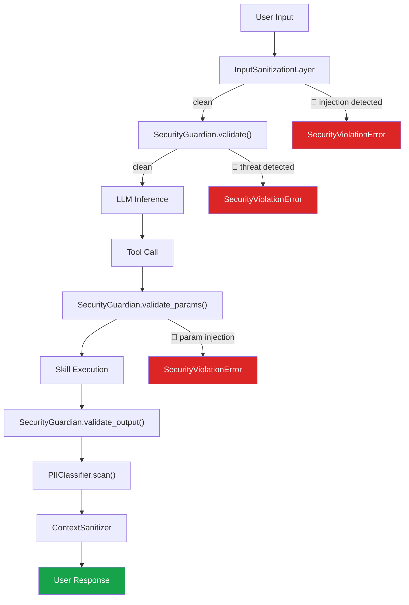

# Security & Compliance — SGR Kernel

> **Версия**: 3.0 | **Источники**: [`core/security.py`](file:///c:/Users/macht/SA/sgr_kernel/core/security.py), [`core/pii_classifier.py`](file:///c:/Users/macht/SA/sgr_kernel/core/pii_classifier.py), [`core/compliance/`](file:///c:/Users/macht/SA/sgr_kernel/core/compliance)

---

## Архитектура безопасности

SGR Kernel реализует **Defense-in-Depth** — многослойную защиту на уровне ввода, параметров, вывода и контекста:

---

## Компоненты

### 1. InputSanitizationLayer

**Первая линия обороны** — эвристический фильтр до отправки в LLM.

| Функция | Описание |
|:--------|:---------|
| Prompt Injection | Детекция `ignore previous instructions`, `system:`, вложенных промптов |
| Длина ввода | Максимум 15 000 символов (настраиваемо) |
| Encoding bypass | Детекция Base64, hex-encoded команд |

**Исключение при срабатывании:** `SecurityViolationError`

### 2. SecurityGuardian

**Основной модуль безопасности** с regex-based pattern matching (9.7 KB кода).

#### Паттерны входных угроз (BLOCK_PATTERNS):

| Категория | Примеры |
|:----------|:--------|
| **Exfiltration & Obfuscation** | `curl`, `wget`, `base64`, `exec()`, `eval()` |
| **Code Injection** | `__import__`, `subprocess`, `os.system` |
| **Prompt Manipulation** | `ignore previous`, `new instructions`, system prompt override |
| **File System Access** | `../../`, path traversal, `rm -rf` |
| **Credential Exposure** | API keys, tokens, passwords in output |

#### Три точки валидации:

1. **`validate(input_text)`** — проверка пользовательского ввода
2. **`validate_params(params)`** — проверка параметров скилла (защита от indirect injection через шаблоны)
3. **`validate_output(output)`** — санитизация вывода, маскирование секретов

### 3. PIIClassifier

**Классификация и маскирование персональных данных** (5.2 KB).

| Тип PII | Паттерн | Маскировка |
|:--------|:--------|:-----------|
| Email | `user@domain.com` | `[PII:EMAIL]` |
| Телефон | `+7-999-...` | `[PII:PHONE]` |
| ИНН/СНИЛС | Числовые паттерны | `[PII:TAX_ID]` |
| Банковские реквизиты | Номера карт, IBAN | `[PII:FINANCIAL]` |

### 4. ContextSanitizer

**Защита при передаче контекста между агентами** в multi-tenant среде.

| Функция | Описание |
|:--------|:---------|
| Field filtering | Только `allowed_fields` передаются следующему агенту |
| PII stripping | Автоматическая фильтрация чувствительных текстов |
| JSON parsing | Безопасный парсинг и ре-сериализация контекста |
| Org isolation | Изоляция по `org_id` |

---

## Compliance

| Регуляция | Реализация | Компонент |
|:----------|:-----------|:----------|
| **152-ФЗ** (RU) | Локализация данных, аудит-лог всех операций | `ComplianceEngine`, `AuditLogger` |
| **GDPR** (EU) | Right to erasure, PII masking, consent tracking | `PIIClassifier`, `ContextSanitizer` |
| **HIPAA** (US) | Secure audit trails, encrypted storage | `EventStore`, `CheckpointManager` |

Compliance Engine использует **Compliance DSL** для декларативного определения политик маршрутизации данных на основе юрисдикции.

---

## Middleware-интеграция безопасности

Безопасность встроена в **middleware pipeline** (см. [API Contracts](api_contracts.md)):

1. `PolicyMiddleware` → проверяет ACL-политику (risk_level, cost_class, capabilities)
2. `ApprovalMiddleware` → эскалация оператору для `HIGH` risk операций
3. `SecurityGuardian` → regex-валидация на входе/выходе
4. `PIIClassifier` → финальная санитизация перед ответом

> [!IMPORTANT]
> Важный архитектурный принцип: **Security — это не отдельный сервис, а встроенный слой**, исполняющийся в том же процессе для минимальной задержки.
