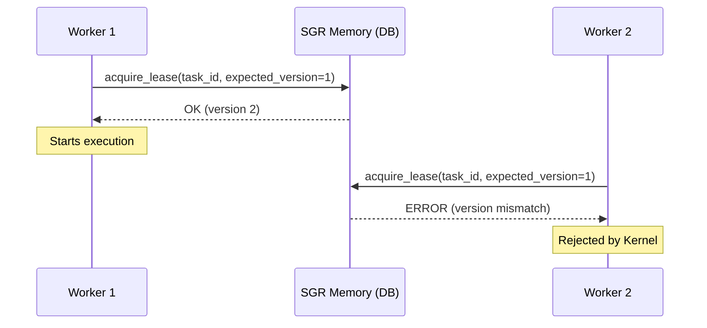

# Why SGR Kernel?

## The Problem Existing Systems Don't Solve

Imagine: you are writing a payment processing service. You added:

- Retries on timeouts ✅
- Idempotency at the DB level ✅
- Logging of every step ✅

But during a network partition or a worker crash:

- The payment is charged twice ❌
- Order state goes out of sync ❌
- You cannot **prove** the system behaves correctly ❌

This is not your fault. It is an **architectural gap** in modern distributed systems.

## What Do Existing Solutions Do?

| System | Solves | Does Not Solve |
|---------|--------|-----------|
| **Kubernetes** | Container scheduling | Application-level execution guarantees |
| **Temporal/Cadence** | Workflow orchestration | Formal correctness invariants |
| **Kafka** | "At-least-once" message delivery | Atomic visibility of side effects |
| **PostgreSQL** | ACID transactions within one DB | Distributed correctness across services |

## What Does SGR Kernel Do?

SGR Kernel is a **minimal execution core** with formally defined guarantees. Here is what this abstraction layer looks like in code:

```python
from sgr_kernel import SGRKernel

kernel = SGRKernel()

# The kernel handles exclusivity, idempotency,
# and duplicate rejection out of the box:
@kernel.task(retries=3, idempotency_key="tx_123")
async def process_payment(amount: float):
    return await bank_api.charge(amount)
```

Core Guarantees:

### 🔹 [Execution Exclusivity (I1)](https://github.com/scarseze/SGR-Kernel/blob/main/docs/RFC_SGR_KERNEL_L8.md#invariant-1-execution-exclusivity-i1)
> At most one worker can hold a valid lease for a task.

**How:** CAS operations on `lease_version` + `SERIALIZABLE` isolation.



### 🔹 [Bounded Duplication (I3)](https://github.com/scarseze/SGR-Kernel/blob/main/docs/RFC_SGR_KERNEL_L8.md#invariant-3-bounded-duplication-i3)
> Execution duplication is bounded to &le; 1 attempt per lease cycle.

**How:** Lease timeouts + safety margins + rejection of stale workers.

### 🔹 [Atomic Visibility (I4)](https://github.com/scarseze/SGR-Kernel/blob/main/docs/RFC_SGR_KERNEL_L8.md#invariant-4-atomic-visibility-i4)
> Partial results are never visible externally.

**How:** Commit marker protocol in object storage (`_SUCCESS` + checksum).

### 🔹 [Eventual Progress (I5)](https://github.com/scarseze/SGR-Kernel/blob/main/docs/RFC_SGR_KERNEL_L8.md#invariant-5-eventual-progress-i5)
> All tasks eventually complete under bounded contention.

**How:** Admission control + retry budgets + priority escalation.

## Who Is It For?

SGR Kernel is not for everyone. It is needed when **correctness is more important than development speed**:

| Field | Use Case |
|-------|---------------------|
| 💳 Fintech | Billing, payments, reconciliations — where duplication = lost money |
| 🏥 HealthTech | Medical data processing — where inconsistency = risk |
| ⚖️ Compliance | Audited systems (GDPR, HIPAA) — where you must prove correctness |
| 🤖 AI Agents | Orchestration of LLM workflows — where retries can spawn hallucinations |
| 🔐 Crypto | Transaction processing — where "exactly once" is the law |

## Philosophy

> **Execution correctness is a fundamental right of a distributed system, not a paid feature.**

SGR Kernel is open-source because:

- Formal guarantees should be available to everyone, not just enterprise.
- Security through transparency: code and invariants are open for audit.
- Community is the best way to find edge-cases and harden the system.

<!-- === EARLY ADOPTERS — HONEST VERSION === -->
<section class="early-adopters" style="margin: 3rem 0; padding: 1.5rem; background: #f8fafc; border-left: 4px solid #22c55e; border-radius: 0 8px 8px 0;">
  <h3 style="margin-top: 0;">🚀 Early Adoption</h3>
  
  <p><strong>SGR Kernel</strong> currently powers:</p>
  
  <ul style="margin: 1rem 0;">
    <li>✅ <strong>Personal production use</strong> — deterministic execution for critical pet-project workloads</li>
    <li>🔍 <strong>Open RFC review</strong> — architecture validated by community feedback</li>
    <li>🤝 <strong>First external adopters?</strong> — <a href="https://github.com/scarseze/SGR-Kernel-R7/issues/new?title=Early+Adopter:+[Project+Name]&labels=early-adopter" target="_blank">Be the first →</a></li>
  </ul>
  
  <p style="font-size: 0.9rem; color: #64748b; margin-bottom: 0;">
    <em>Built by one engineer who believes correctness is a fundamental right. Join the journey.</em>
  </p>
</section>

## Start Now

```bash
# 1. Clone
git clone https://github.com/scarseze/sgr-kernel

# 2. Run Demo
cd examples/payment-demo && docker-compose up

# 3. See the Guarantee in Action
# (try "killing" the worker during execution — the task will restart without duplication)
```

👉 [Architecture](architecture.md) • [RFC](https://github.com/scarseze/SGR-Kernel/blob/main/docs/RFC_SGR_KERNEL_L8.md) • [Contributing](https://github.com/scarseze/SGR-Kernel/blob/main/CONTRIBUTING.md)
