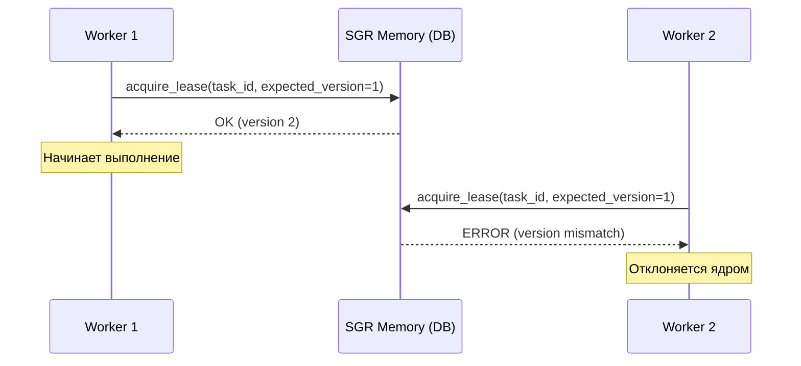

# Почему SGR Kernel?

## Проблема, которую не решают существующие системы

Представь: ты пишешь сервис обработки платежей. Ты добавил:

- Ретраи при таймаутах ✅
- Идемпотентность на уровне БД ✅
- Логирование каждого шага ✅

Но при сетевом разделении или краше воркера:

- Платёж списывается дважды ❌
- Состояние заказа рассинхронизируется ❌
- Ты не можешь **доказать**, что система ведёт себя корректно ❌

Это не твоя ошибка. Это **архитектурный пробел** в современных распределённых системах.

## Что делают существующие решения?

| Система | Решает | Не решает |
||--|--|
| **Kubernetes** | Планирование контейнеров | Гарантии выполнения на уровне приложения |
| **Temporal/Cadence** | Оркестрацию workflow | Формальные инварианты корректности |
| **Kafka** | Доставку сообщений «хотя бы один раз» | Атомарную видимость побочных эффектов |
| **PostgreSQL** | ACID-транзакции в одной БД | Распределённую корректность across services |

## Что делает SGR Kernel?

SGR Kernel — это **минимальное ядро выполнения** с формально определёнными гарантиями. Вот как выглядит этот слой абстракции в коде:

```python
from sgr_kernel import SGRKernel

kernel = SGRKernel()

# Ядро само позаботится об эксклюзивности,
# идемпотентности и отбрасывании дублей:
@kernel.task(retries=3, idempotency_key="tx_123")
async def process_payment(amount: float):
    return await bank_api.charge(amount)
```

Гарантии ядра:

### 🔹 [Execution Exclusivity (I1)](https://github.com/scarseze/SGR-Kernel/blob/main/docs/RFC_SGR_KERNEL_L8.md#invariant-1-execution-exclusivity-i1)
> Максимум один воркер может удерживать валидную аренду (lease) для задачи.

**Как:** CAS-операции на `lease_version` + изоляция `SERIALIZABLE`.



### 🔹 [Bounded Duplication (I3)](https://github.com/scarseze/SGR-Kernel/blob/main/docs/RFC_SGR_KERNEL_L8.md#invariant-3-bounded-duplication-i3)
> Дублирование выполнения ограничено ≤ 1 попытки на цикл аренды.

**Как:** Таймауты аренды + запас прочности + отклонение устаревших воркеров.

### 🔹 [Atomic Visibility (I4)](https://github.com/scarseze/SGR-Kernel/blob/main/docs/RFC_SGR_KERNEL_L8.md#invariant-4-atomic-visibility-i4)
> Частичные результаты не видны извне.

**Как:** Протокол маркера коммита в объектном хранилище (`_SUCCESS` + checksum).

### 🔹 [Eventual Progress (I5)](https://github.com/scarseze/SGR-Kernel/blob/main/docs/RFC_SGR_KERNEL_L8.md#invariant-5-eventual-progress-i5)
> Все задачи завершаются при ограниченной конкуренции.

**Как:** Admission control + бюджеты на ретраи + эскалация приоритетов.

## Для кого это?

SGR Kernel — не для всех. Он нужен, когда **корректность важнее скорости разработки**:

| Сфера | Пример использования |
|-||
| 💳 Финтех | Биллинг, платежи, сверки — где дублирование = потеря денег |
| 🏥 HealthTech | Обработка медицинских данных — где несогласованность = риск |
| ⚖️ Compliance | Системы с аудитом (152-ФЗ, GDPR, HIPAA) — где нужно доказывать корректность |
| 🤖 AI-агенты | Оркестрация LLM-воркфлоу — где ретраи могут породить галлюцинации |
| 🔐 Крипто | Обработка транзакций — где «ровно один раз» — это закон |

## Философия

> **Корректность выполнения — это базовое право распределённой системы, а не платная фича.**

SGR Kernel — open-source, потому что:

- Формальные гарантии должны быть доступны всем, а не только enterprise
- Безопасность через прозрачность: код и инварианты открыты для аудита
- Комьюнити — лучший способ найти edge-cases и усилить систему

<!-- === EARLY ADOPTERS — HONEST VERSION === -->
<section class="early-adopters" style="margin: 3rem 0; padding: 1.5rem; background: #f8fafc; border-left: 4px solid #22c55e; border-radius: 0 8px 8px 0;">
  <h3 style="margin-top: 0;">🚀 Раннее внедрение</h3>
  
  <p><strong>SGR Kernel</strong> на данный момент обеспечивает:</p>
  
  <ul style="margin: 1rem 0;">
    <li>✅ <strong>Личное использование в продакшене</strong> — детерминированное выполнение для критических пет-проектов</li>
    <li>🔍 <strong>Открытый аудит RFC</strong> — архитектура подтверждена отзывами сообщества</li>
    <li>🤝 <strong>Первые внешние пользователи?</strong> — <a href="https://github.com/scarseze/SGR-Kernel-R7/issues/new?title=Early+Adopter:+[Project+Name]&labels=early-adopter" target="_blank">Стань первым →</a></li>
  </ul>
  
  <p style="font-size: 0.9rem; color: #64748b; margin-bottom: 0;">
    <em>Создано одним инженером, который верит, что корректность — это базовое право. Присоединяйтесь к развитию.</em>
  </p>
</section>

## Начни сейчас

```bash
# 1. Клонировать
git clone https://github.com/scarseze/sgr-kernel

# 2. Запустить демо
cd examples/payment-demo && docker-compose up

# 3. Увидеть гарантию в действии
# (попробуй «убить» воркер во время выполнения — задача перезапустится без дублирования)
```

👉 [Архитектура](architecture.md) • [RFC](https://github.com/scarseze/SGR-Kernel/blob/main/docs/RFC_SGR_KERNEL_L8.md) • [Внести вклад](https://github.com/scarseze/SGR-Kernel/blob/main/CONTRIBUTING.md)
